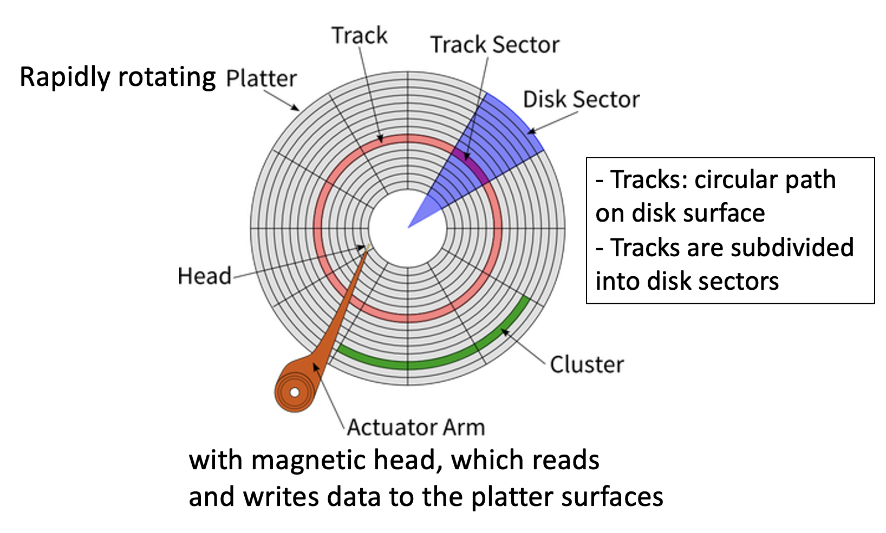
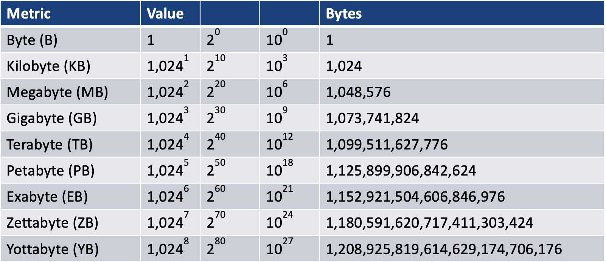
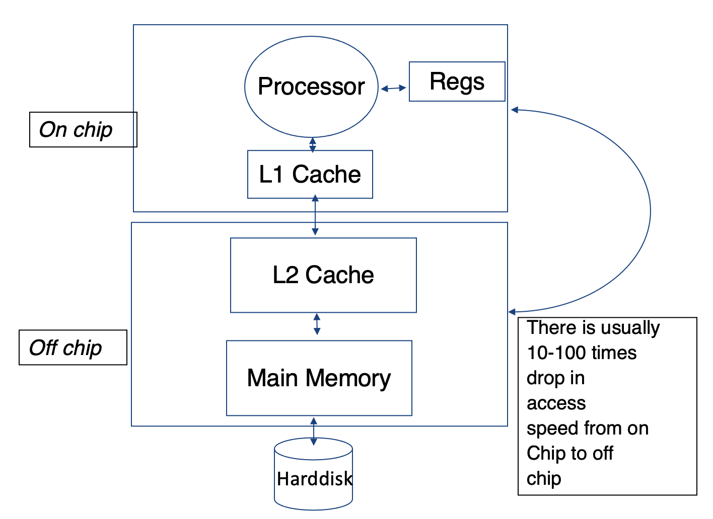
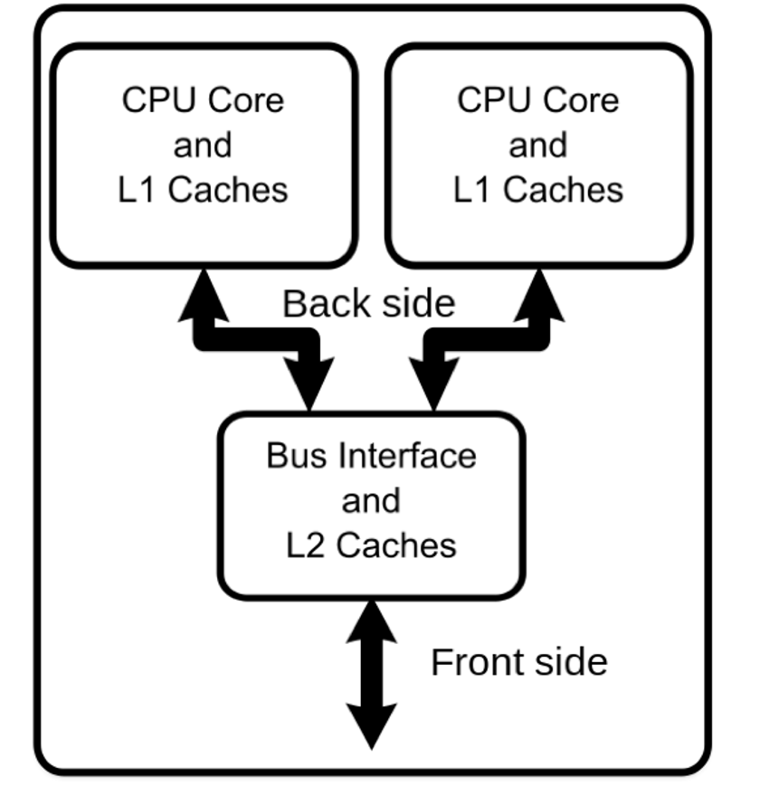
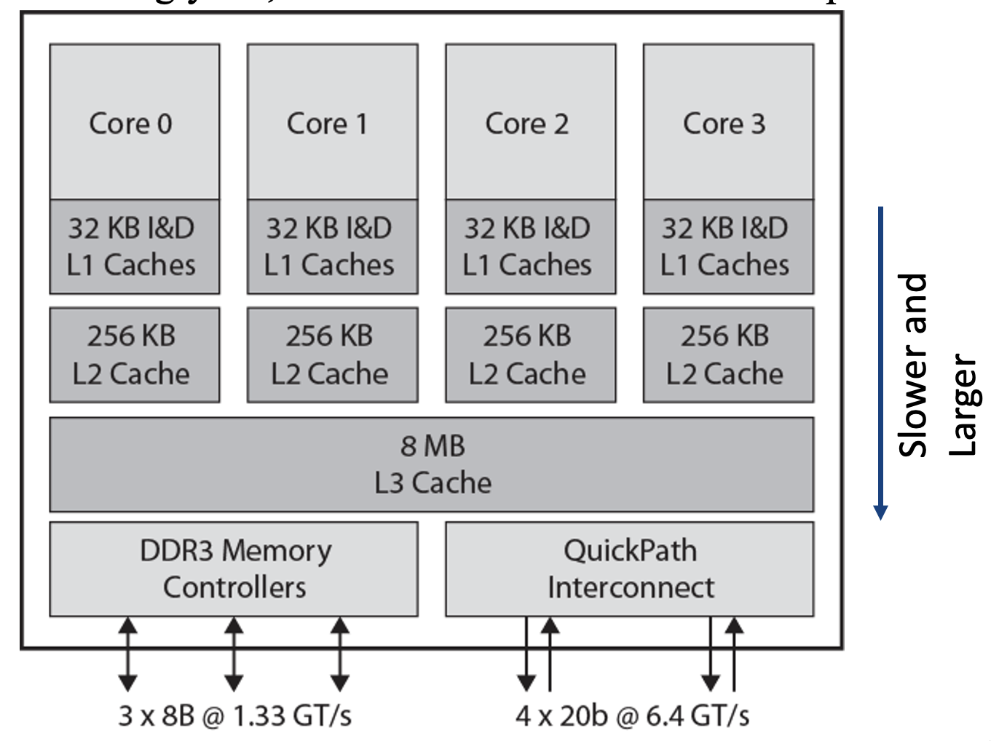
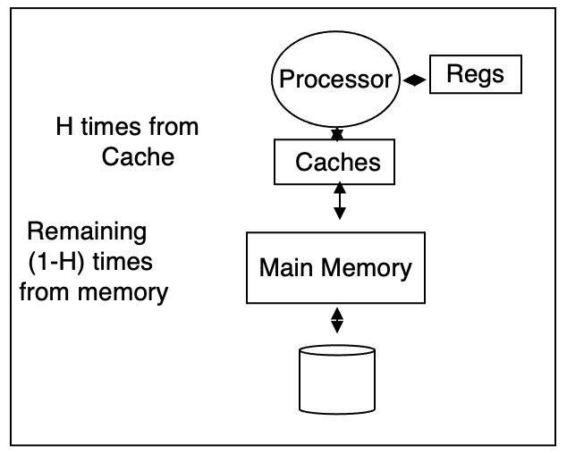
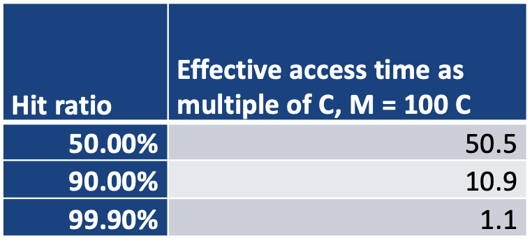
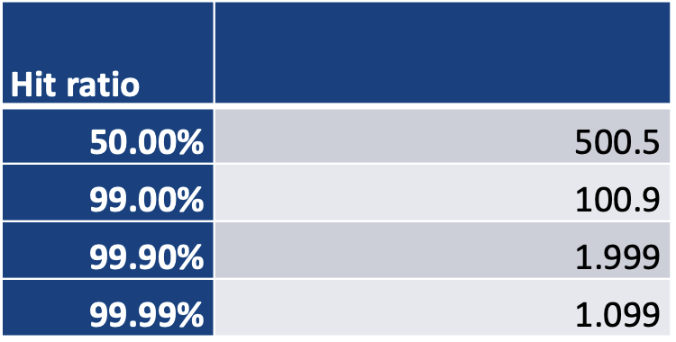

# Lecture 1 and 2

## Introduction

* Today's data:
    * Includes more aspects of businesses
    * Getting larger
    * More complex and includes novel data types such as images
    * Stored in various sites and accessed by many users
    
* Storing data across a few files is inadequate because:
    * As data grows one or more files become cumbersome(难以处理的) to store data
    * As users who access it grows, it becomes hard to coordinate access
    * As system grow, it is hard to guard against loss, breach(数据泄露), or damage to data
    
* A database system thus provides:
    * Secure and reliable storage of data
    * Ability to retrieve and process the data effectively and efficiently
    
### Performance factor of a database system
    
* Hardware:
    * The speed of the processor
    * Number of processor
    * Number of disk drives and I/O bandwidth
    * Size of main memory
    * Communication network
    * Type of architecture
    
* Software:
    * Type of database technology used for a given application
    
* Database tuning, crash recovery
    * Indexing parameters
    * Data duplication
    * Sharing data
    
## Hardware

### Basic Hardware of a classical disk
> 

### Disk Access for Classical Disk

* 

* E.g. What is the Disk Access Time for a transfer size of 4KB when average seek time is 12ms, rotation delay 4ms, transfer rate 4 MB/sec?
  > transfer rate 4 MB/sec = 4 KB/ms  
  > Disk access time = 12ms + 4ms + (4KB) / (4 KB/ms) = 12 + 4 + 1 = 17 ms
  
### Solid-State Drive/Disk (SSD)

* No moving parts like Hard Disk Drive(HDD)
* Silicon rather than magnetic materials
* No seek/rotational latency
* No start-up times like HDD
* Runs silently
* Random access of typically under 100 micro-seconds compared to 2000-3000 micro-seconds for HDD
* Relatively very expensive, thus did not dominate at all front yet
* Certain read/write limitations plagued for years
* 

### Other Hardware Considerations

* Memory chip: Moore's Law: Memory chip capacity doubles every 18 months since 1970:
  > 
  
* Processors: Joy's Law: Process performance doubles every two years since 1984:
  > 
  
* Networking:
  * More databases are distributed
  * The network hardware speed are at the speed of light already
  * The network router firmware/software forms the bottleneck: will they be upgraded every year?
  
### Storage Metrics Conversion Table
> 

## The Memory Hierarchy

> 

### Multi-Core System

> 

* Increasingly L1, L2, and L3 caches are on the chip now:
> 

### Hit Ratio

* Hit ratio: A calculation of cache hits, and comparing them with how many total content requests were received
  * Cache Hits: The situation wherein the cache is able to successfully retrieve data and content that was saved to it
  > 
  
* Effective memory access time(EA): 
  > 
  
* Illustration:
  > 
  
* E.g.
  > 
  
* Effective disk buffer access time: Caching provided with HDD for access:
    > 
  
* E.g. 
  > 
  
## Database Systems

### Types of Database Systems

* [Simple File](#simple_file): As a plain text file. Each line holds one record,  with fields separated by delimiters.
* [Relational Database Systems](#RDBS): As a collection of tables(relations) consisting of rows and column. A primary key is used to uniquely identify each row.
* [Object Oriented](#OOR): Data stored in the form of objects directly
* [No-SQL](#no-sql): Non relational - database modelled other than the tabular relations. Covers a wide range of database types.

<h3 id="simple_file">Simple File</h3>

* Usually very fast for simple applications but can be slow for complex applications
* Can be less reliable
* Application dependent optimization
* Very hard to maintain (concurrency problem)
* Many of the required features need to be incorporated - unnecessary code development and potential increase in unreliability
* Eventually were left behind for most business cases
* Some very specialized cases like scientific data may use them

<h3 id="RDBS">Relational Database Systems</h3>

* Very reliable in terms of consistency of data
* Application independent optimization, so relatively fast
* Well suited for more applications, increasingly very fast due to large main memory machines and increasing used of SSDs
* Some relational database also support Object Oriented model. E.g. Oracle, DB2, XML data + queries
* Can be slow for some special applications

<h3 id="OOR">Object Oriented Database Systems</h3>

* Stores as objects directly, not tables
* May contain both data(attributes) and methods
* Can be slow on some applications
* Reliable
* Limited application independent optimization
* Well suited for applications requiring complex data
* Unfortunately, many commercial systems started did not survive the force of RDB technology and basically disappeared from the market

<h3 id="no-sql">No-SQL</h3>

* Flexible, not fixed schema
* Provides a mechanism for storage and retrieval of data modelled in means other than the tabular relations, used with big data
* Simple design, should linearly scale
* No-SQL has compromise consistency and allows replications.
* Most No-SQL databases offer "eventual consistency", which might result in reading data from an older version, a problem known as stale reads
* Types of No-SQL databases:
  * Key-Values: E.g. Riak, Tokyo Cabinet, Redis server, Memcached, Scalaris
    * Stores data as a collection for key-value pairs, where each key is unique, each record many have different fields
    * Why useful: Many applications do not require the expressive functionality of transaction processing and rigidity
    * Used for building very fast, highly parallel processing of large data. E.g. MapReduce and Hadoop
    * Atomic updates at Key-value pair level only
  * Document-based: E.g. MongoDB, CouchDB, OrientDB, RavenDB
  * Column-based: E.g. BigTable, Cassandra, Hbase, Hypertable
  * Graph-based: Neo4J, InfoGrid, Infinite Graph, Flock DB
  
* Deductive database systems:
  * Allows recursion, similar to logic programming like Prolog
  * Works on rules and facts and make deductions
  * Most of the application can be developed entirely using DDBS
  * There are no commercially available
  * Many applications do not require the expressive power of these systems
  * Many RDBs do provide some of the functionalities