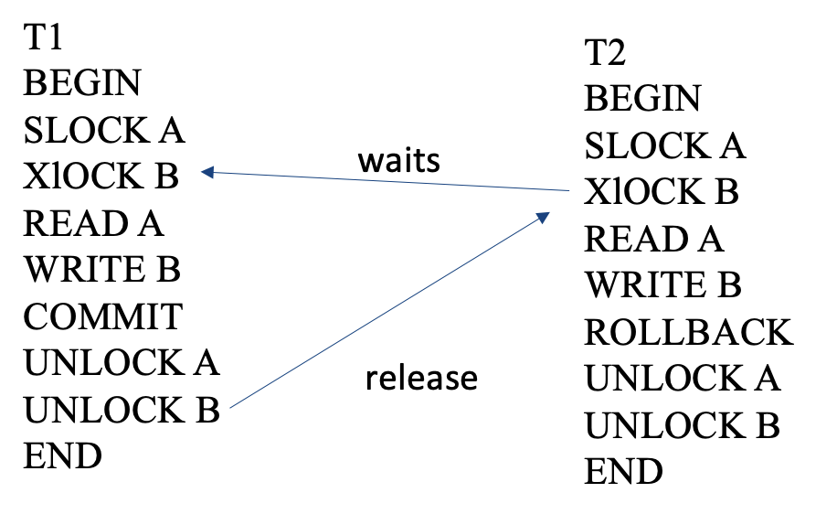
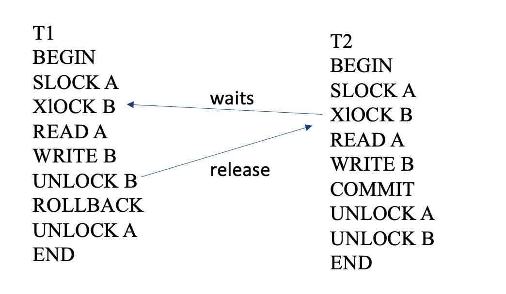
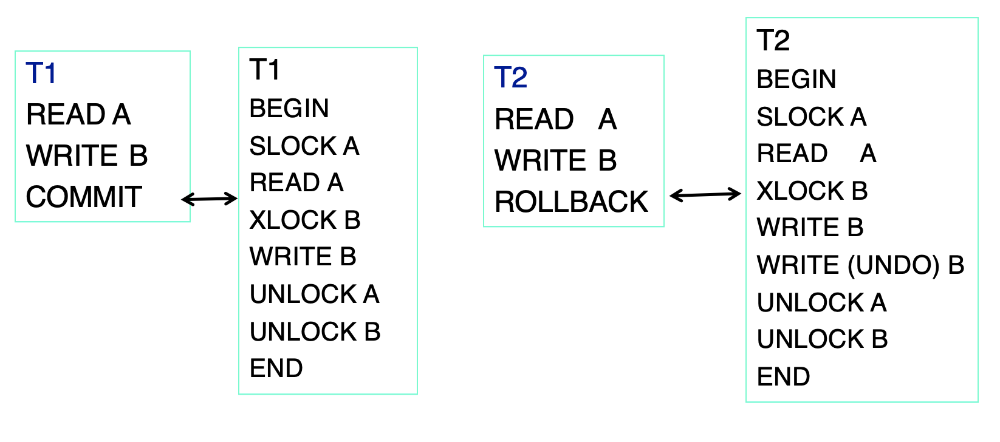
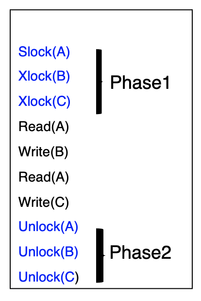
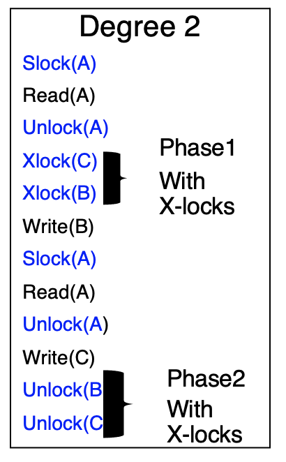
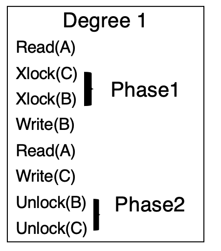
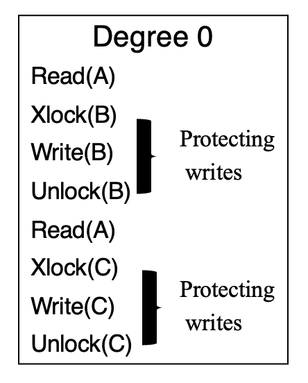

# Lecture 10

### How to Ensure No Wormholes Appear

* Simple method: Use lock carefully

* Introduce a new type of lock: Shared Lock (SLOCK)

* Shared Lock allows other transactions to read, but not write or modify the shared resource

### Lock Compatibility

* A lock on an object should not be granted to a transaction while that object is locked by another transaction in an incompatible mode

* Lock Compatibility Matrix:

<table>
<tr>
<th></th>
<th colspan="3">Mode Of Lock</th>
</tr>
<tr>
<td>Current Mode</td>
<td>Free</td>
<td>Shared</td>
<td>Exclusive</td>
</tr>
<tr>
<td>Shared Request (SLOCK)<br>Used to block others writing or modifying</td>
<td>Compatible<br>Request granted immediately <br> Changes Mode from Free to Shared</td>
<td>Compatible<br>Request granted immediately <br> Mode stays Shared</td>
<td>Conflict<br>Request delayed until the state becomes compatible <br> Mode stays Exclusive</td>
</tr>
<tr>
<td>Exclusive request (XLOCK) <br>Used to block others reading, writing or modifying</td>
<td>Compatible<br>Request granted immediately<br>Changes Mode form Free to Exclusive</td>
<td>Conflict<br>Request delayed until the state becomes compatible<br>Mode stays Shared</td>
<td>Conflict<br>Request delayed until the state becomes compatible<br>Mode stays Exclusive</td>
</tr>
</table>

### When to Use What Type of Lock

* Types of actions in a transaction:
    * READ
    * WRITE
    * XLOCK
    * SLOCK
    * UNLOCK
    * BEGIN
    * COMMIT
    * ROLLBACK
    
* E.g. of Transactions:
    ```
    Transaction 1:
    BEGIN
    SLOCK A
    XLOCK B
    READ A
    WRITE B
    COMMIT
    UNLOCK A
    UNLOCK B
    END
  
    Transaction 2:
    BEGIN
    SLOCK A
    XLOCK B
    READ A
    WRITE B
    ROLLBACK
    UNLOCK A
    UNLOCK B
    END
    ```
  
* Dependency of the E.g. transactions:
    > 
  
* Without a strategy for locking and unlocking for transactions, things may not work
    * E.g.
        > 
      
### Isolation concepts

* `BEGIN`, `END`, `SLOCK`, `XLOCK` can be ignored as they can be automatically inserted in terms of the corresponding operations
    * E.g.: If a transaction ends with a `COMMIT`, it is replaced with: `{UNLOCK A if SLOCK A or XLOCK A appears in T for any object A}`
    * Similarly `ROLLBACK` can be replaced by: 
        ```
        {WRITE (UNDO) A if WRITE A appears in T for any object A}
        {UNLOCK A if SLOCK A or XLOCK A appears in T for any object A}
        ```
      
* Can replace transaction sequences by for brevity:
    > 
  
### Isolation Theorem

* A transaction is a sequence of `READ`, `WRITE`, `SLOCK`, `XLOCK` actions on objects ending with `COMMIT` or `ROLLBACK`

* A transaction is well-formed if each `READ`, `WRITE`, and `UNLOCK` operation is covered earlier by a corresponding lock operation

* A history is legal if does not grant conflicting grants

* A transaction is two phase if its all lock operations precede its unlock operation 

* Locking theorem: If all transactions are well-formed and two-phased, then any legal history will be isolated

* Locking theorem Converse: If a transaction is not well-formed or is not two-phased, then it is possible to write another transaction such
    that it is a wormhole transaction
  
* Rollback theorem: An update transaction that does an `UNLOCK` and then does a `ROLLBACK` is not two phase

### Serializability

* Using two-phase locking we guarantee serializability

* Serializability: is the concurrent execution of a set transactions is equal to one of the serial execution of the same set of transactions. 
    Thus isolation property is achieved
  
* It is easy to see that it is different from locking each object independently

* The strategy ensures a transaction has the set of locks needed by getting all of them in phase 1 before releasing any in phase 2.
    Thus preventing any transaction getting in-between.
  
### Efficiency Concerns

* The more locking we do the more restricted we get in terms of what concurrent transactions we allow

* Practitioners observed that some of these are not needed in practice in every front and instead concurrency should take high precedence.
    Thus, one can define degrees of isolation
  
## Degrees of Isolation 

### Degree 3

* A third degree isolation of transactions will have no lost updates, no dirty reads and has repeatable reads. This is true isolation

* Lock protocol is two-phased and well-formed.

* It is sensitive to the following conflicts:
    * `WRITE` -> `WRITE`
    * `WRITE` -> `READ`
    * `READ` -> `WRITE`
    
* Illustration:
    > 
  
### Degree 2

* A second degree of isolation of transaction has no lost updates and no dirty reads

* Lock protocol is two-phased with respect to exclusive locks and well-formed with respect to reads and writes

* May have unrepeatable reads

* It is sensitive to the follow conflicts:
    * `WRITE` -> `WRITE`
    * `WRITE` -> `READ`
    
* Illustration:
    > 
  
### Degree 1

* A one degree isolation has no lost updates

* Lock protocol is two-phased with respect to exclusive locks and well-formed with respect to writes

* It is sensitive to following conflicts:
    * `WRITE` -> `WRITE`

* Illustration:
    > 
  
### Degree 0

* A zero degree isolation of transactions does not overwrite another transactions dirty data if the other transaction is at least one degree

* Lock protocol is well-formed with respect to writes

* Ignores all conflicts

* Illustration:
    > 
  
## Phantoms and Predicate Locks

* If locks are taken at finest possible granularity then we may be performing updates which otherwise should be delay.
    This is good for efficiency but have some issue.
  
* E.g. For a SQL query:
    ```sql
    SELECT * 
    FROM emp
    WHERE eyes = "blue" and hair = "red";
    ```
    * This transaction takes shared locks on all tuples satisfying the constraint `eyes = "blue" and hair = "red"`.
        However, after granting these locks a new transaction may try to insert a new tuple satisfying the constraint while the transaction is running
    
* These cases are called phantom records

* Predicate locks solve this problem. Rather than locking records, lock based on condition holding.

* Page locks can solve this problem. Lock the `red hair` page and the `blue eye` page, prevents other `red hair` and `blue eye` inserts and updates.
    In this case, the storage should be organized based on values of attributes
  
* High volume systems use specialized locking mechanisms too:
    * Key Range Locks: Protecting b-trees
    * Hole Locks: Protect space for uncommitted deletes
    
### Predicate Locks

* Read and write sets can be defined by predicates and associate a lock with such a set

* When a transaction accesses a set for the first time:
    1. Automatically capture the predicate and associate appropriate lock with such a predicate
    2. Do set intersection with predicates of other transactions
    3. Delay this transaction if it conflicts with others that is if there is an overlap which leads to a lock conflict
    
* Issues with predicate locks:
    * Set intersection = predicate satisfiability is a NP complete problem. Slow to impossible to show in realistic time.
    * Hard to capture predicates at times
    * Pessimistic approach
    
### Strict Two-phase Locking(S2PL)

* This is when there is no shrinking phase

* Locks have to be released when commit/abort happens

* Stricter than two-phase locking

* Reduces concurrency and efficiency further

* But good for preventing cascading aborts:
    * E.g.: These are cases when abort leads to many transactions aborting because for example they read an object that is written by the aborting transactions.
    * They should have read only values that were committed