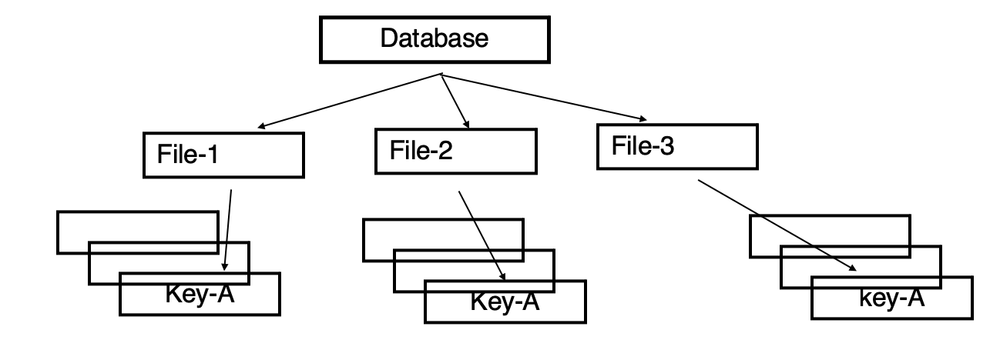
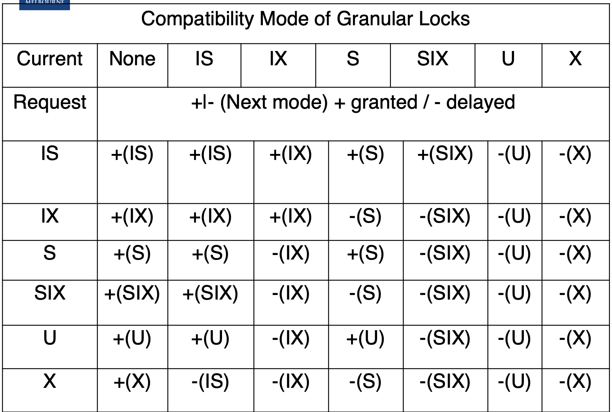

# Lecture 11-12

## Granularity of Locks

* Multiple concurrently running transactions may cause conflicts
* Still we try to allow concurrent runs as much as possible for better performances, while avoiding conflicts as much as possible
* Extending locking-based solutions: Use granular locks:
    * Build a hierarchy
    * Locks can be taken at any level
    * Will automatically grant the locks on its descendents
    
* E.g.:
    * Pick a set of column values (predicates).
    * Then form a graph/tree structure
    * Lock the nodes in the graph/tree when needed
    * Sample architecture:  
        > 
    
        * This allows locking of the whole database, whole file, or just one key value
        * Locking the whole database -> less conflicts, but poor performance
        * Lock at individual records level -> more locks, better performance
    
### Intention Mode Locks

* Compatibility Matrix on coarse granule:

<table>
<tr>
<th>Mode</th>
<th>Free</th>
<th>Intention</th>
<th>Shared</th>
<th>Exclusive</th>
</tr>
<tr>
<td><b>Intention Request(ILOCK)</b></td>
<td><b>Compatible</b><br>Request granted immediately <br>Change mode from free to Intention</td>
<td><b>Compatible</b><br>Request granted immediately <br>Mode stays Intention</td>
<td><b>Conflict</b><br>Request delayed until state is compatible <br>Mode stays Shared</td>
<td><b>Conflict</b><br>Request delayed until state is compatible <br>Mode stays Exclusive</td>
</tr>
<tr>
<td><b>Shared Request(SLOCK)</b></td>
<td><b>Compatible</b><br>Request granted immediately <br>Change mode from free to Shared</td>
<td><b>Conflict</b><br>Request delayed until state is compatible <br>Mode stays Intention</td>
<td><b>Compatible</b><br>Request granted immediately <br>Mode stays Shared</td>
<td><b>Conflict</b><br>Request delayed until state is compatible <br>Mode stays Exclusive</td>
</tr>
<tr>
<td><b>Exclusive Request(XLOCK)</b></td>
<td><b>Compatible</b><br>Request granted immediately <br>Change mode from free to Exclusive</td>
<td><b>Conflict</b>Request delayed until state is compatible <br>Mode stays Intention</td>
<td><b>Conflict</b>Request delayed until state is compatible <br>Mode stays Shared</td>
<td><b>Conflict</b>Request delayed until state is compatible <br>Mode stays Exclusive</td>
</tr>
</table>

### Granular Locks in Practice

* `X`: Exclusive Lock
* `S`: Shared Lock
* `U`: Update Lock
* `IS`: Intent set Shared locks at finer granularity
* `IX`: Intent set shared or exclusive locks at finer
* `SIX`: A coarse granularity shared lock with an intent to set finer granularity exclusive locks
* Procedure:
    1. Acquire locks from root to leaf
    2. Release locks from leaf to root
    
* To acquire an `S` mode or `IS` mode lock on a non-root node, one parent must be held in `IS` mode 
    or higher mode (one of {`IS`, `IX`, `S`, `SIX`, `U`, `X`})
  
* To acquire an `X`, `U`, `SIX`, or `IX` mode lock on non-root node, all parents must be held in `IX` mode 
    or higher mode (one of {`IX`, `SIX`, `U`, `X`})
  
### Tree Locking and Intent Lock Modes

* `IS` allows `IS` and `S` mode locks at finer granularity and prevents others from holding `X` on this node
* `IX` allows to set `IS`, `IX`, `S`, `SIX`, `U` and `X` mode locks at finer granularity and prevents others holding `S`, `SIX`, `X`, `U` on this node
* `S` allows read authority to the node and its descendants at a finer granularity and prevents other holding `IX`, `X`, `SIX` on this node
* `SIX` allows read to the node and its descendants as in `IS` and prevents others holding `X`, `U`, `IX`, `SIX`, `S` on this node 
    or its descendants but allows the holder `IX`, `U`, and `X` mode locks at finer granularity. `SIX` = `S` + `IX`
  
* `U` allows read to the node and its descendants and prevents others holding `X`, `U`, `SIX`, `IX`, and `IS` locks on this node or its descendants
* `X` allows writes to the node and prevents others holding `X`, `U`, `S`, `SIX`, `IX` locks on this node and all its descendants
* Compatibility Matrix:
    > 
  
### Update Mode Locks

* E.g. 
    * T1:
        ```
        SLOCK A
        READ A
        if (A == 3) {
            % Upgrading SLOCK to XLOCK
            XLOCK A
            WRITE A
        }
        UNLOCK A
        ```
    * T2:
        ```
        SLOCK A
        READ A
        if (A == 5) {
            % Upgrading SLOCK to XLOCK
            XLOCK A
            WRITE A
        }
        UNLOCK A
        ```
    * T3:
        ```
        SLOCK A
        READ A
        UNLOCK A
        ```
      
    * This example might cause deadlock:
        * Granting the first `UNLOCK` excludes granting any other subsequent locks, and thus eliminates simple deadlocks
            in addition also reduces starvation caused by subsequent shared lock requests by not granting them immediately
          
### Two-version Locking

* There are other extensions to locking mechanisms. One of them is two-version locking
* Two-version locking can allow more concurrency as well
* The idea is to allow one transaction to write tentative versions. While other transactions read from the committed versions.
    Thus reads are only delayed while transactions are being committed rather than during entire transaction
  
* Commits in general are much shorter than a transaction
* Compatibility Matrix:

<table>
<tr>
<th>State/Mode</th>
<th>Free</th>
<th>Read</th>
<th>Write</th>
<th>Commit</th>
</tr>
<tr>
<td>Read</td>
<td>Granted</td>
<td>Granted</td>
<td>Granted</td>
<td>Delayed</td>
</tr>
<tr>
<td>Write</td>
<td>Granted</td>
<td>Granted</td>
<td>Delayed</td>
<td>Delayed</td>
</tr>
<tr>
<td>Commit</td>
<td>Granted</td>
<td>Delayed</td>
<td>N/A</td>
<td>N/A</td>
</tr>
</table>
    
### Nested Transactions and Locking

* Nested transactions require special attention in locking
* The aim is each set of nested transactions is a single entity that must be prevented from observing partial effects of other such sets
* Also, each subtransaction in a set must not observe partial effects of transactions in the set
* Firstly each subtransaction's lock are inherited by its ancestors as a rule when it completes
* Inherited locks should also be inherited recursively. This ensures top level can decide ultimately
* Also, parents cannot run concurrently with children
* Children can use the locks of parent
* The compatibility matrix is the same with reads and writes
* Key: Subtransactions at same level that access the same obejct take turns to acquire the locks of the parent for serializability

## Optimistic Concurrency Control

* When conflicts are rare, transactions can execute operations without managing locks and without waiting for locks. This leads to higher throughput
* Use data without locks
* Before committing, each transaction verifies that no other transaction has modified the data by taking appropriate locks. Therefore the duration of locks are very short
* If any conflict found, the transaction repeats the attempt
* If no conflict, make changes and commit
* E.g.:
    ```
    READ A into A1
    READ B into B1
    READ C into C1
    
    % Compute some values based on A1, and B1 and C1
    
    % Start taking locks
    SLOCK A; READ A into A2
    SLOCK B; READ B into B2
    XLOCK C; READ C into C2
    
    % Once the condition is true - it is effectively 2 phase locking but duration of locking is very short but can 
    % lead to many repeated attempts due to failure of the condition if the system is busy
    if (A1 == A2 & B1 == B2 & C1 == C2) {
        WRITE t into C
        COMMIT
        UNLOCK A, B and C
    } else { % data has changed
        UNLOCK A, B and C
        goto START
    }
    ```
  
### Snapshot Isolation

* Not the same thing as serializability
* It became popular in some DBMSs. E.g. Oracle
* Snapshot isolation is related to optimistic concurrency control mentality
* Very high throughput in comparison to simple locking mechanisms
* The rule is that a transaction reads objects and when it comes to write:
    * Checks if what needs to be written is changed.
        * If not, it is allowed to commit
        * Else, it has to abort
    * Other changes like things read are not checked
    
* E.g.
    ```
    READ C into C1
    READ D into D1
    Start of LOOP:
        READ A into A1
        READ B into B1
        COMPUTE new values based on A1 and B1
    % Start taking locks on objecst that need modification
    % Let new value for C is C3 and for D is D3
    XLOCK C
    XLOCK D
    READ C into C2
    READ D into D2
    if (C1 == C2 & D1 == D2){
        % Commit
        WRITE C3 to C
        WRITE D3 to D
        COMMIT 
        UNLOCK C and D
    } else { % not the first modifier
        C1 = C2
        D1 = D2
        UNLOCK C and D
        GOTO LOOP
    ```
  
### Two Phase Locking Transaction

* Integrity constraint: A + B >= 0; A = 100, B = 100

* T1:
    ```
    LOCK(X, A)
    LOCK(S, B)
    READ A to A1;
    READ B to B1;
    A1 = A1 - 200;
    if (A1 + B1 >= 0){
        WRITE A1 to A
        COMMIT
    } else {
        ABORT;
    }
    END
    UNLOCK (all locks)
    ```
  
* T2:
    ```
    LOCK(S, A)
    LOCK(X, B)
    READ A to A1;
    READ B to B1;
    B1 = B1 - 200;
    if (A1 + B1 >= 0){
        WRITE B1 to B;
        COMMIT
    } else {
        ABORT;
    }
    END
    UNLOCK (all locks)
    ```
  
* Only one transaction can commit

### Using Snapshot Isolation

* Same constraints as previous

* T1:
    ```
    LOOP:
        READ A to A1;
        READ B to B1;
        A3 = A1 - 200;
        LOCK(X, A)
        READ A to A2;
        if (A1 != A2) {
            UNLOCK(A)
            GOTO LOOP
        else if (A3 + B1 >= 0) {
            WRITE A3 to A;
            COMMIT
        } else {
            ABORT
        }
    UNLOCK (all locks)
    ```
  
* T2:
    ```
    LOOP:   
        READ A to A1;
        READ B to B1;
        B3 = B1 - 200;
        LOCK(X, B)
        READ B to B2;
        if (B1 != B2) {
            UNLOCK(B);
            goto LOOP;
        } else if (A1 + B3 >= 0) {
            WRITE B3 to B;
            COMMIT
        } else {
            ABORT
        }
    UNLOCK (all locks)
    ```
  
* One or both transactions can commit but when both are committed, not that it is not serializable as only one should be able to commit.

### Snapshot Isolation Application

* In cases where we have issues there are workarounds
* In multiversion systems: Similar to two-version locking where we only check for conflicts at the end, make a check at the end and decide
* Leave it to the user to deal with constraint satisfaction for non-trivial cases

### Optimistic Concurrency Control Variants

* Optimistic Concurrency Control with backward validation

* Optimistic Concurrency Control with forward validation

### Backward Validation 

* Transaction `T` which is the current transaction makes the check
* Creates a read set that it has performed during execution
* Look whether any other transaction that it is overlapping with has changed anything it has read
* If so then takes actions

### Forward Validation

* Transaction `T` which is the current transaction makes the check
* Creates a write set that it has performed during execution
* Looks whether any other transaction that it is overlapping with has read anything it has written. Assuming they are still active
* Make a choice of:
    * Delay current transaction
    * Abort all the conflicting ones
    * Abort current transaction
    
* It has more choices
* One has to decide based on cost. In general, whether to use backward, or forward validation as well

## Timestamp-based Concurrency Control

* This is a form of optimistic concurrency control from a point of view
* The validation process happens similar to Optimistic Concurrency Control
* The main difference is validation happens as transactions do their operations continuously
* Validation per operation and abortion is imminent
* As the name suggests decisions are based on the timestamps
* Transactions and operations can be ordered based on timestamps
* Ordering Rules:
    * To accept a `WRITE` by transaction `T` on object `D` check:
        * If `T` >= maximum read timestamp on `D` and `T` > write timestamp on current committed `D`, then write `D` with timestamp of `T`
        * Else Abort `T`
    
    * To accept a read by transaction `T` on object `D` check:
        * If `T` > write timestamp on current committed `D`, then perform read
        * Else Abort `T`
    * We can write a version of this to wait rather than abort if there is a transaction that is writing `D`
    
### Multiversion Timestamping

* Some actually argue that timestamps are pessimistic rather than optimistic as thet lead to aborts a lot based on a single read.
* In this newer version, multiple versions of the same object is maintained. Thus when things do not align then the right version
    of an object can be used.
  
* For example when a read operation arrives late it can be allowed to read from an older version hence not conflicting with existing transactions and no need to abort
* Sometimes this is also called multiversion timestamp ordering

### Comparison of Concurrency Control Schemes

* Timestamp ordering statically assigns orders for transactions based on time of commencement
* Locking is dynamic on this front as order is decided at object access time
* For read-only transactions multiversion timestamp ordering is fast
* When there are many updates two-phase locking is good as it has less aborts
* Timestamp-based methods abort immediate which may be good some times
* If there aren't many updates an optimistic approach is better
* All of these schemes have difficulties when transactions are long running. This is common in CAD and other similar cases
* In such cases, merging of versions with user intervention may be a better path than aborting any one of the transactions