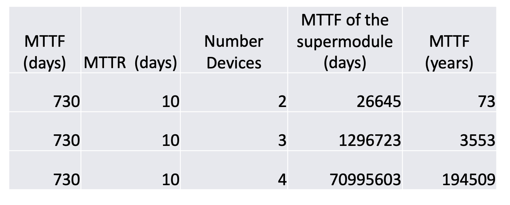

# Lecture 13 and 14 Transactions and Networking

### DBMSs in the Era of Internet

* Almost all database management systems of today are networked
* Some would use a client-server architecture where a two-phase locking strategy with a simple/abort command would work as everything still on one server
* Many large corporations today have multiple sites/servers. In addition, they give access to users around the world
* They do not have data in one place nor they can or want to populate one data center
* These imply that many systems do not have client-server model but a more distributed architecture 
* This is a problem for transactional systems

### Problems related to lack of having one data center

* E.g. Nested banking transactions run really fast in a distributed way:
    > 
  
    * Client transfers $10 from `A` to `C` and then transfers $20 from `B` to `D`:
        ```
        T = openTransaction
            openSubTransaction
                a.withdraw(10);
            openSubTransaction
                b.withdraw(20);
            openSubTransaction
                c.deposit(10);
            openSubTransaction
                d.deposit(20);
        ```
      
    * Requests can be run in parallel. With several servers, the nested transaction is more efficient
    
* Problem: What if branch `Z` has a problem?
    * If branch `Z` rollback, `A` and `B` has already withdrawn but `C` and `D` does not executed the transations
    
* Solution: A flat or nested transaction that accesses objects managed by multiple servers when a transaction comes to an end will have to make sure:
    * Either all of the servers commit the transactions
    * Or all of them abort the transaction
    * One of the servers becomes the coordinator, it must ensure the same outcome at all of the servers
    * Two-phase commit protocol is the most commonly used protocol for this purpose
    
* E.g. A flat distributed banking transaction execution steps
    > 
    
    * Transaction steps:
    ```
    T = openTransaction
            a.withdraw(4)
            c.deposit(4)
            b.withdraw(3)
            d.deposit(3)
        closeTransaction
    ```
    
    * The coordinator is in one of the servers, E.g. branch `X`
    * The TID (T) is passed with each request 
    
## Two-phased Commit

* Transaction atomicity requires that at the end: Either all of its operations are carried out or none
* In a distributed transaction, the client has requested the operations at more than one server.
* One-phase atomic commit protocol:
    * The coordinator tells the participants whether to commit or abort at the end
    * Problem: This does not allow one of the servers to abort. It may have discovered a deadlock or it may have crashed and been restarted
    
* Two-phase atomic commit protocol:
    * Designed to allow any participant to choose to abort a transaction
    * Phase 1: Each participant votes. If it votes to commit, it is prepared. It cannot change its mind. In case it crashed, it must have updates in a permanent store
    * Phase 2: The participant carry out the joint decision
    * If client or participant request abort, the coordinator informs the participants immediately
    * If the client asks to commit, the Two-phase comes into use
    
* 2PC phase labels:
    * Voting phase: Coordinator asks all participants if they can commit
        * If yes, participants records updates in permanent storage and then votes. 
            So, even when there is failure participants can still recover.
          
    * Completion phase: Coordinator tells all participants to commit or abort
    
### Functions to implement Two-phase commit

* `canCommit(trans) -> Yes/No`: Call from coordinator to participant to ask whether it can commit a transaction. 
    Participant replies with its vote
  
* `doCommit(trans)`: Call from coordinator to participant to tell participant to commit its part of a transaction
* `doAbort(trans)`: Call from coordinator to participant to tell participant to abort its part of a transaction
* `haveCommitted(trans, participant)`: Call from participant to coordinator to confirm that it has committed the transaction.
    Just for deleting stale information on the coordinator

* `getDecision(trans) -> Yes/No`: Call from participant to coordinator to ask for the decision on a transaction after it has voted `Yes` but has still had no reply 
    after some delay. Used to recover from server crash or delayed messages.
  
* participant interface: `canCommit`, `doCommit`, `doAbort`
* coordinator interface: `haveCommited`, `getDecision`

### Details of Two-phase Commit Protocol

* Phase 1 voting phase:
    1. The coordinator sends a `canCommit` request to each of the participants in the transaction
    2. When a participant receives a `canCommit` request, it replies with its vote `Yes` or `No`
        to the coordinator. Before voting `Yes`, it prepares to commit by saving objects in permanent storage.
        If the vote is `NO`, the participant aborts immediately.
       
* Phase 2 completion according to outcome of vote:
    3. The coordinator collects the votes including itself:
        1. If there are no failures and all the votes are `Yes`, the coordinator decides to commit the transaction 
            and sends a `doCommit` request to each the participants
            
        2. Otherwise the coordinator decides to abort the transaction and sends `doAbort` requests to all participants that voted `Yes`
    
    4. Participants that voted `Yes` are waiting for a `doCommit` or `doAbort` request from the coordinator.
        When a participant receives one of these message it acts accordingly and in the case of commit,
        makes a `haveCommited` call as confirmation to the coordinator
       
* Communication details in Two-phase commit:
    > 
  
### Failures in Two-phase Commit Protocol

* Time-out actions in the 2PC is used to avoid blocking forever when a process crashes or a message is lost
* Uncertain participant in Step 2 has voted `Yes`, it cannot decide on its own. It uses `getDecision` method to ask coordinator about the outcome
* Participant has carried out client requests, but has not had followup from the coordinator. It can abort unilaterally.
* Coordinator delayed in waiting for votes in Step 1. It can abort and send `doAbort` to participants.

### What happens to concurrency control in networked

* Each server manages a set of objects and is responsible for ensuring that they remain consistent when accessed by concurrent transactions
* Therefore, each server is responsible for applying concurrency control to its own objects
* The members of a collection of servers of distributed transactions are jointly responsible for ensuring that they are performed in a serially equivalent manner
* Transactions independently acting would not work
* If transaction `T` is before transaction `U` in their conflicting access to objects one of the servers then they
    must be in that order at all of the servers whose objects are accessed in a conflicting manner by both `T` and `U`
  
* Coordinator is responsible for this issue. 

### Further updates Locking-based Systems

* The local lock manager decides whether to grant a lock or make the requesting transaction wait in a server as usual
* In a distributed DBMS:
    * It cannot release any locks until it knows that the transaction has been committed or aborted at all the servers involved in the transaction
    * The objects remain locked and are unavailable for other transactions during the atomic commit protocol
        * An aborted transaction releases its locks after phase 1 of the protocol
    
### Timestamp Ordering Concurrency Control for Distributed DBMS

* Single server transactions:
    * Issue a unique timestamp to each transaction before it starts
    * Serial equivalence ensured by committing objects in order of the timestamps
    
* Distributed transactions:
    * The coordinator accessed by a transaction issues a globally unique timestamp
    * The timestamp is passed with each object access
    * The servers are jointly responsible for ensuring serial equivalence.
        * That is if `T` access an object before `U`, then `T` is before `U` at all objects
    
* Timestamp ordering leads to:
    * Conflicts being resolved as each operation is performed
    * If this leads to an abort, the coordinator will be informed. It will abort the transaction at the participants
    * Any transaction that reaches the client request to commit should always be able to do so.
    
### Optimistic Concurrency Control for Distributed DBMS

* Each transaction is validated before it is allowed to commit
    * Transaction numbers can be assigned at start of validation
    * Transactions serialized according to transaction numbers
    * For many servers, each server does independent validation
    
* For distributed transactions to work:
    * Validation takes places in phase 1 of 2PC protocol
    * Transactions use a globally unique numbers for validation
    
## Fault Tolerance

* The aspect that enables a system to continue operating properly in the event of the failure of some components
* For database management systems preservation of data is key
* In particular, hard disks have played a key role on this front

### How System Failed

* Before one invests, one needs to know how things fail and where the important components are and how much would it cost.
* What are the chances of a hard disk failing on one machine?
* What are the chances of one of the hard disks failing on a machine?
* What are the chances of one of the hard disks failing that are installed in two machines but they were in the same lab?
* What are the chances of one of the hard disks failing that are installed in two machines but they were key in different rooms in the same building?

### Statistics and Probability are the Key to Understanding Fault Tolerance

* Everything fails eventually so it is all about time and events happening in time
* So we are interested in a certain event happening in some timeframe based on some statistical observations about that component
* Thus we estimate things like:
    * `P(A)` = probability of a hard disk failing which we call event `A`, given a certain period of time `t`
        * As `t` goes to infinity `P(A)` = 1
    
* `P(A)` = probability of an event `A` happening in a certain period
* `P(A and B)` = probability both `A` and `B` happening in a certain period
* `P(A and B)` = `P(A)` * `P(B)` assuming `A` and `B` are independent event
* `P(A or B)` = `P(A)` + `P(B)` - `P(A and B)`
* Mean time to event `A` is : `MT(A)` = `1/P(A)`
* If events `A` and `B` have mean time `MT(A)` and `MT(B)`, then the mean time to the first event:
    * `MT(A or B)` = `1/P(A or B)`
    
* If there are `n` events, each with the same probability `p`, then:
    * Probability that one of the event occur = `n` * `p`
    * Mean time to one of the events = `1/(n * p)` = `(1/p) * (1/n)`  = `m * (1/n)` = `m/n`
    
### System Lifecycle

> 

* Module availability: Measures the ratio of service accomplishment to elapsed time
    > Module availability = Mean time to Failure / (Mean time to failure + Mean time to repair)
  
* Systems based on fault tolerance:
    > 
  
### Causes of System Off Time

* Environmental: Failures such as temperature, power, weather, data communication lines, fires earthquakes, tsunami, wars, sabotage
* Operational: System administration, system configuration, and system operation procedures
* Maintenance: Procedures for regular maintenance, replacement of hardware on regular basis
* Hardware: Devices, cooling
* Software: Programs
* Process: Strikes, management decision for shutdowns

### Failure Rates

* Bathtub Failure Rate Curve:
    > 
  
* Disk Failure Rates:
    > 
  
## Fault Tolerance by RAID

* RAID: A famous architecture for storage
* Redundant Array of Independent Disks/Drives: Different ways to combine multiple disks as a unit for fault tolerance 
    or performance improvement, or both commonly used with a database system
  
* RAID level zero:
    * Illustration:
        > 
      
    * `A0, A1, A2, ...` are contiguous blocks of data of a file
    * Provides balanced I/O of disk drives - throughput approximately doubles
    * Any disk failure will be catastrophic and mean time to failure reduces by factor of 2
    * Higher throughput at the cost of increased vulnerability to failures
    
* RAID level one: Mirroring
    * Illustration:
        > 
      
    * Provides higher read throughput but lower write throughput
    * Half storage utilization
    * Mean time to failure increases substantially. Quadratic improvement.
    * Continues to operate as long as one disk is functional
    
* RAID level two: Bit level striping
    * Illustration:
        > 
      
    * Striping takes place at bit level
    * Provides higher transfer rate. Double the single disk
    * Mean time to failure reduced by half as in RAID Level zero
    * Rarely used
    
* RAID level three: Byte level striping
    * Illustration:
        > 
  
    * `B0, B1, B2, B3, ...` are bytes of data of file
    * Striping takes place at byte level
    * Rarely used
    * Provides higher transfer rate as in RAID level zero
    * P<sub>0</sub> is parity for bytes B<sub>0</sub> and B<sub>1</sub>
    * P<sub>i</sub> = B<sub>2i</sub> &oplus; B<sub>2i+1</sub>, here &oplus; is exclusive-or operator
    * Mean time to failure increases substantially. 1/3 of RAID level 1. As one disk failure can be recovered from the data of the other 2 disks
    
* RAID level four: Block level striping
    * Illustration:
        > 
      
    * Striping takes place at block level
    * Dedicated disk for parity blocks
    * Provides higher throughput but very slow writes. Disk3 has more write as Parity needs to be updated for every data write
    * Mean time to failure increase substantially. Same as RAID level three
    * P<sub>i</sub> = A<sub>2i</sub> &oplus; A<sub>2i+1</sub>, here &oplus; is an exclusive-or operator
    
* RAID level five with 3 disks: Block level level striping
    * Illustration:
        > 
      
    * `A0, A1, A2, A3, ...` are contiguous blocks of data of a file
    * Striping takes place at block level
    * Parity blocks are also striped
    * Provides higher throughput but slower writes but better than RAID level four as parity bits are distributed 
        among all disks and the number of write operations on average equal among all 3 disks
      
    * Mean time to failure increases substantially. Same as RAID level three
    * P<sub>i</sub> = A<sub>2i</sub> &oplus; A<sub>2i+1</sub>, here &oplus; is an exclusive-or operator
 
* RAID level six: Block level level striping 
    * Illustration:
        > 
      
    * Similar to RAID level 5 except two parity blocks used
    * Reliability is of the order of MTTF<sup>3</sup>/10
    * `P0` and `P1` are parity blocks for blocks `A0, A1, and A2`. These are computed in such way that any two disk failures can be safe to recover the data
    
### Fault Tolerance by Voting

* Use more than one module, voting for higher reliability
* Failvote: Stops if there are no majority agreement
* Failfast: Similar to failvote, except the system senses which modules are available and uses the majority of the available modules
* E.g. A 10 module Failfast system continues to operate until the failure of 9 modules where as Failvote stops when 5 modules fail
* Failfast system has better availability than failvoting since failvote stops when there is no majority agreement
* In failfast, we are only concerned of majority among the working ones. We are assuming that we can tell which ones are working.
    Hence we can continue to operate until 2 working ones and if both agree we can proceed with the action. But if they differ the system stops.
  
### Fault Tolerance for Disks

* Naturally, a system with multiple hard disk drives is expected to function with only one working disk -- Supermodule
* Use voting when multiple disks are working/available. But still work when only one is available.

### Availability of failvote systems

* If there are `n` events, mean time to the first event = `m/n`
* Consider a system with modules each with MTTF of 10 years
* Failvoting with 2 devices:
    * MTTF = 10/2 = 5 years -> System fails with 1 device failure
    
* Failvoting with 3 devices:
    * MTTF = 10/3 for the first failure + 10/2 for the second failure = 8.3 years
    
* Lower availability for higher reliability. Multiple modules agreeing on a value means that value is more likely to be accurate/reliable

## Fault Tolerance with Repair

* With repair modules: The faulty equipment is repaired with an average time of MTTR (mean time to repair) as soon as
    a fault is detected. Sometimes MTTR is just time needed to replace
  
* Typical values for recent disks:
    * MTTR = Few hours to one day
    * MTTF = 750000 hours approximately 86 years
    
* Probability of particular module is not available = MTTR / (MTTF + MTTR) &cong; MTTR/MTTF if MTTF >> MTTR

### Fault Tolerance of a supermodule with repair

* Probability that `n-1` modules are unavailable P<sub>n-1</sub> = (MTTR / MTTF)<sup>n-1</sup>
* Probability that a particular i<sup>th</sup> module fails P<sub>f</sub> = (1/MTTF)
* Probability that the system fails with a particular i<sup>th</sup> module failing last = P<sub>f</sub> * P<sub>n-1</sub> = (1/MTTF) * (MTTR / MTTF)<sup>n-1</sup>
* Probability that a supermodule fails due to any one of the `n` modules failing last, when other `n-1` modules are unavailable = (n/MTTF) * (MTTR / MTTF)<sup>n-1</sup>
* E.g.
    > 
  