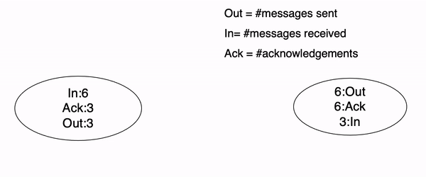
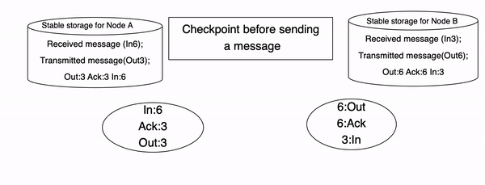
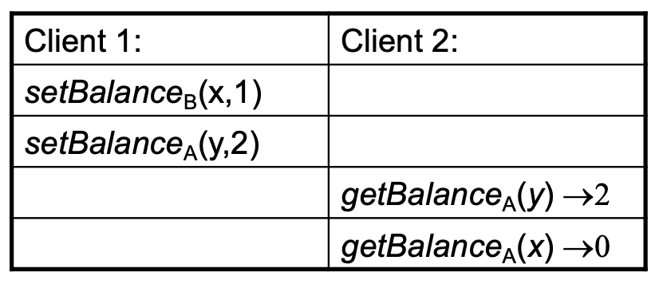
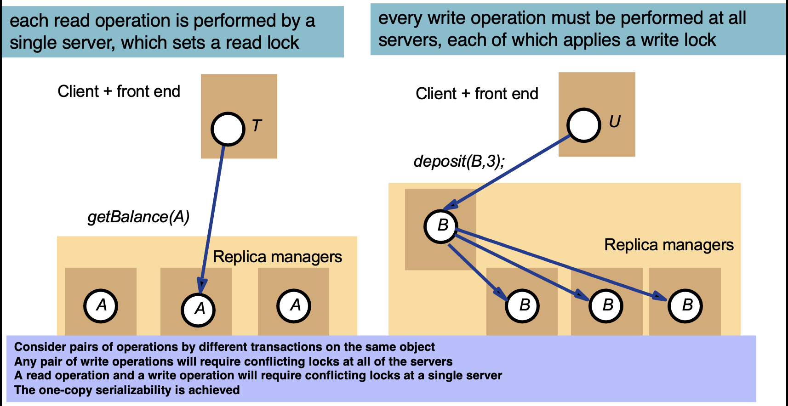
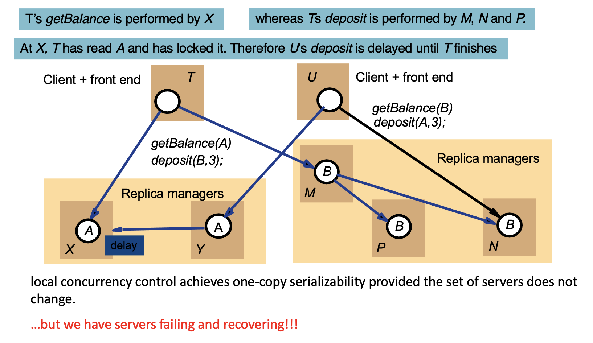
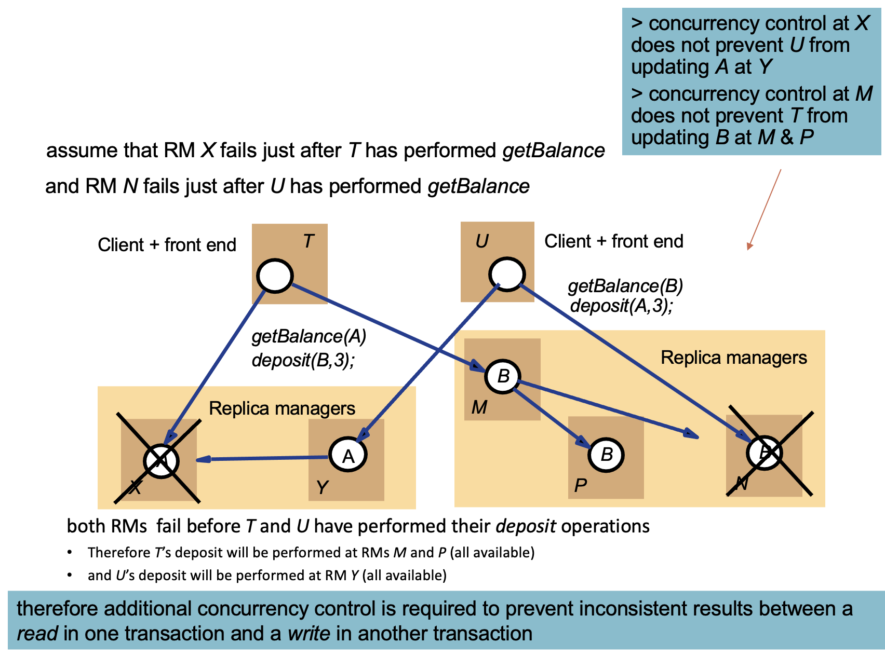
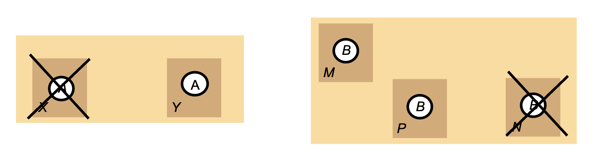

# Lecture 15

## Software Failures

* Main distinction between software and hardware reliability:
    * Hardware reliability requires tolerating components
    * Software reliability requires tolerating design and coding faults
    * This distinction between hardware and software is becoming less as most hardware units have substantial amount of software components called embedded systems
    
### Improving Software Reliability

* N-version programming:
    * Use n programs that run in parallel, take majority vote for each answer
    * The diversity of design and coding can mask many failures
    
* Software reliability as transaction: Abort and restart:
    * Write a program as an ACID state transformation with consistency checks. If the consistency checks are not met, then abort and restart
    * A recent consistent system state is restored after restart
    
* Process pairing:
    * Primary process does all the work until it fails. The second process takes over the primary and continues
    * Primary needs to tell on a regular basis that it is alice and also transmit its state to the secondary
    * Three different ways to takeover:
        * Checkpoint-restart: The primary records its state on a second storage module. At takeover, the secondary starts 
            reading the state of the primary from the storage and resumes the application.
          
        * Checkpoint-messages: The primary sends its state changes as messages to the backup. At takeover, the backup gets 
            its current state from the most recent checkpoint message
            
        * Persistent: Backup restarts in the null state and lets a transactional mechanism to clean up all uncommitted transactions.
    
### Communication Reliability

* Reliable message passing:
    > 
  
* Checkpoint before sending a message:
    > 
  
### Exposing Fault Recovery Mechanisms

* Until now we assumed storage units or processes recover from faults in a manner that is not visible to outside
* There is little a DBMS need to do in many of those cases.
* Not all recovery or tolerance mechanisms are so transparent
* E.g. of replication of data on hard disks:
    * Assuming replicas are in different sites for increased availability
    * The replication is thus visible to process include DBMSs that work on the distributed system
    * Problem: Systems can be constructed to replicate objects without producing the anomalous behaviour
        > 
        
        * At `A` and `B` maintain copies of `x` and `y`:
            * Clients use local server when available, otherwise the other one.
            * Servers propagate updates to one another after replying to client
        * Initial balance of `x` and `y` is $0
        * Client `1` updates `x` at `B` at local then finds `B` has failed, so uses `A`
        * Client `2` reads balances at `A` at local:
            * As client `1` updates `y` after `x`, client `2` should see $1 for `x`
        * That is what should be expected if we had only one copy/CPU answering
        * Not the behaviour that would occur if `A` and `B` were implemented at a single server
    
### Transactions with Replicated Data

* Focus on transactional systems but there are problems and measures for non-transactional systems in replica management
* The effect for transactions on replicated objects should be the same as if they had been performed one at a time on a single set of objects
* This property is called one-copy serializability
* Each server provides concurrency control and recovery of its own objects to start with
    * Assume two-phase locking in the section
    * Other schemes can be updated accordingly as well
    
* In read one/write all replication, one server is required for a read  request and all servers for a write request:
    > 
  
* The system above might fail unless all copies are available
    * The simple read one/write all scheme is not realistic:
        * Because it cannot be carried out if some of the servers are unavailable which beats the purpose in many cases
        * Either because they have crashed or because of a communication failure. We need to consider failed replicas
      
* The Available Copies replication scheme is designed to allow some servers to be temporarily unavailable
    * A read request can be performed by any available server
    * Write requests are performed by the receiving server and all the other available servers but there is more.
    * Available copies with read one/write all available:
        > 
      
    * Replication Issues:
        > 
      
    * Available Copies replication:
        * Additional measure for concurrency control
            * Before a transaction commits, it checks for failures and recoveries of the RMs it has contacted
                * E.g. `T` would check if `N` is still unavailable and that `X`, `M`, and `P` are still available. If this is the case, `T` can comit
        * Above, we said `X` fails before `T`'s deposit, in which case, `T` would have to abort.
        * `U` checks if `N` is still available. Since `N` is not available, `U` must abort. 
        > 