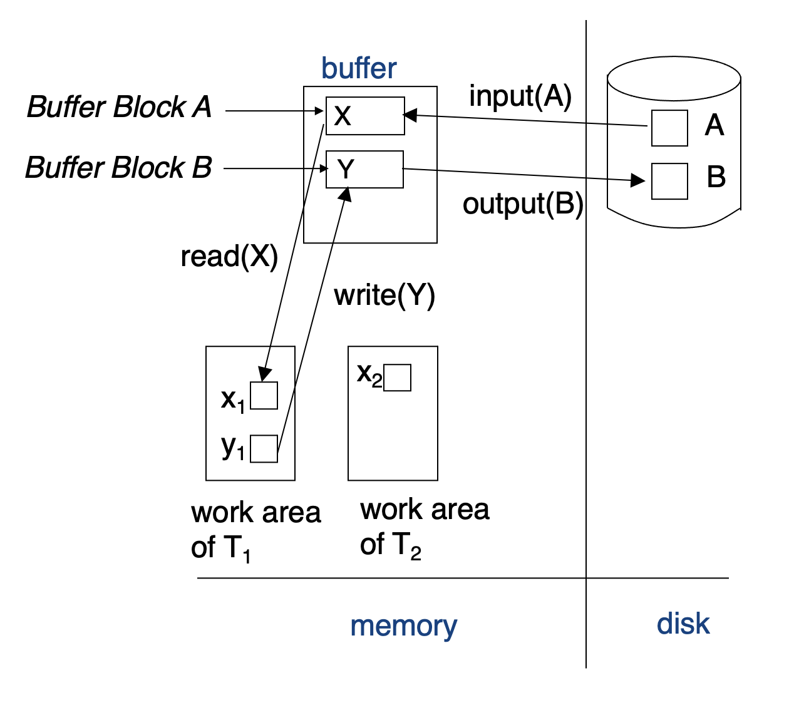
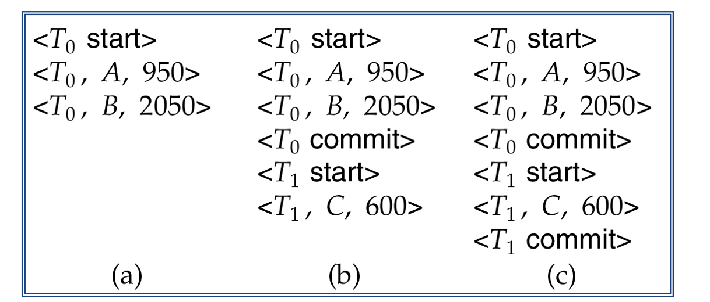
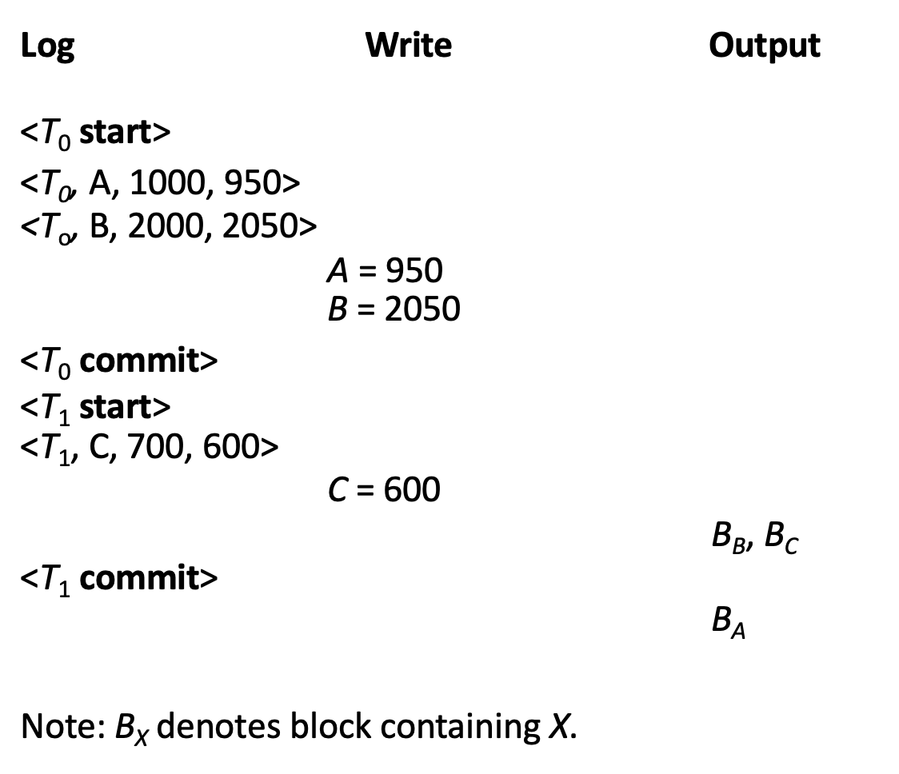
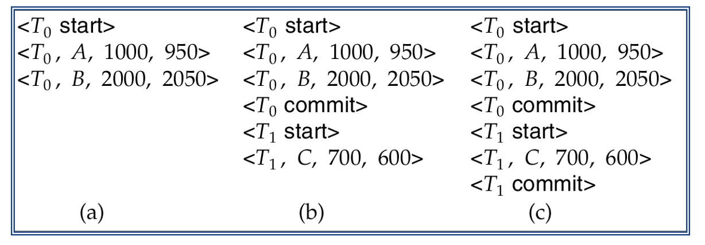
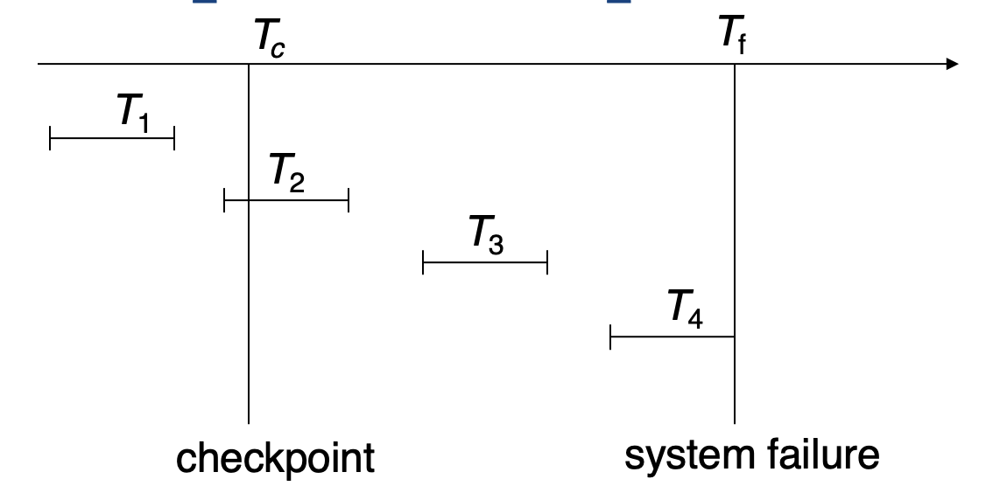
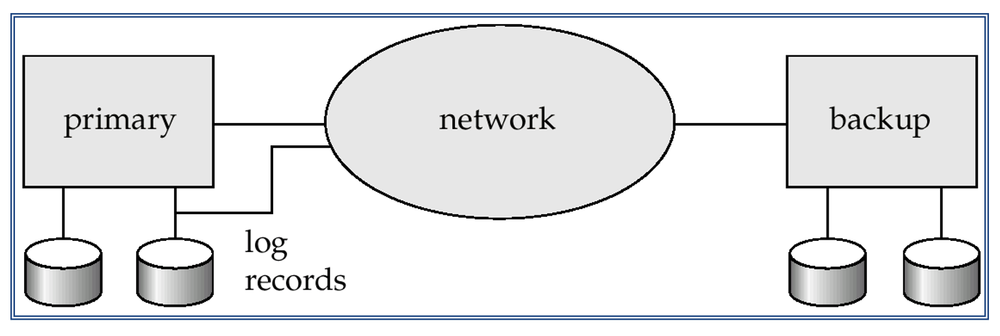
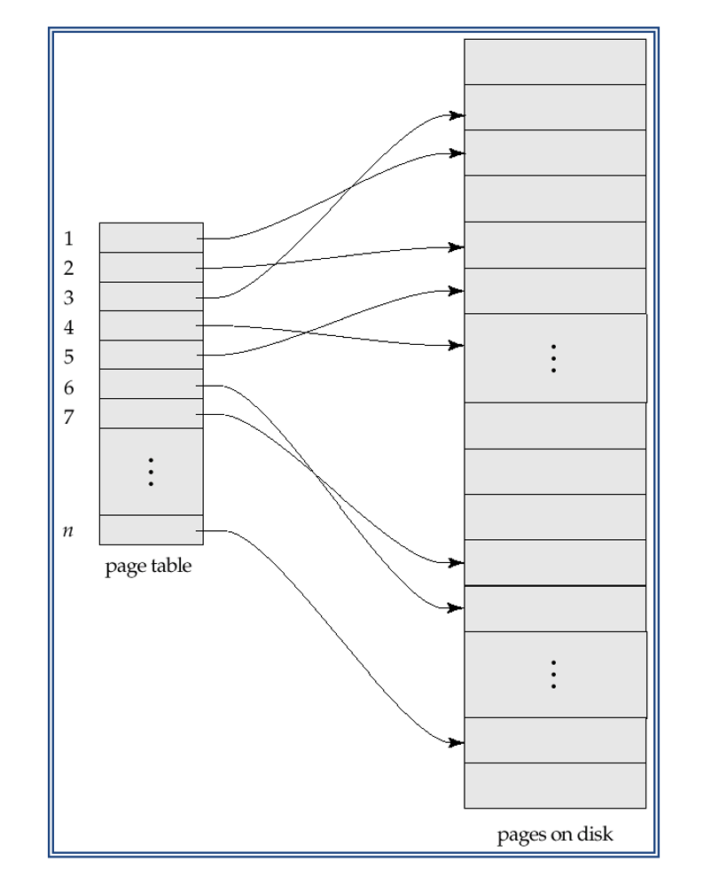
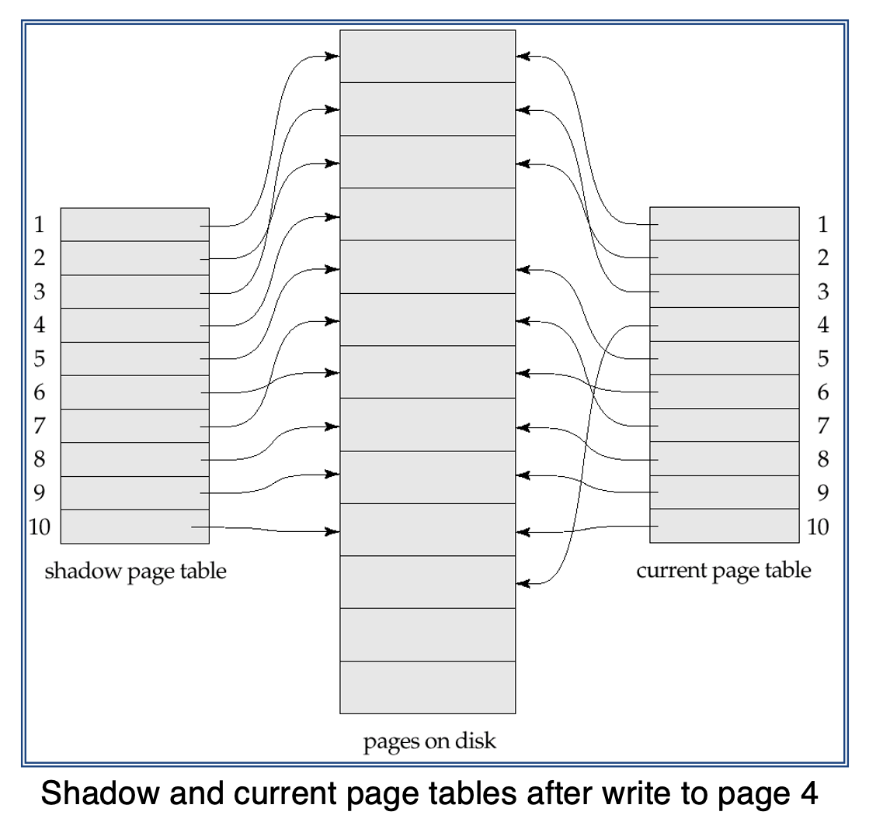

# Lecture 16-17

### Recovery from Failures

* Faults happen, leading to system failures, regardless of how well a system is at hardware or transaction processing
* Recovery mechanisms exist in DBMSs which are techniques to ensure database consistency and transaction atomicity and durability despite failures
* Recovery algorithms have two parts:
    * Actions taken during normal transaction processing to ensure enough information exists to recover from failures
    * Action taken after a failure to recover the database contents to a state that ensures atomicity, consistency, and durability
    
### Storage and Recovery

* Volatile storage:
    * Does not survive system crashes
    * E.g.: main memory, cache memory
    
* Nonvolatile storage / persistent storage:
    * Survives system crashes most of the time
    * E.g.: disk, tape, flash memory, non-volatile RAM
    
* Stable storage:
    * A mythical form of storage that survives all failures
    * Approximated by maintaining multiple copies on distinct nonvolatile media
    
### Stable-Storage Implementation

* Maintain multiple copies of each block on separate disks
    * Copies can be at remote sites to protect against disasters such as fires
    
* Failure during data transfer can still result in inconsistent copies: Block transfer can result in:
    * Partial failure: Destination block has incorrect information
    * Total failure: Destination block was never updated
    
* Solution: Protecting storage media from failure during data transfer:
    * Assuming two copies of each block, execute output operation as:
        1. Write the information onto the first physical block
        2. When the first write successfully completes, write the same information onto the second physical block
        3. The output is completed only after the second write successfully completes. 
    
### Data Access

* Physical blocks: Those blocks residing on the disk
* Buffer blocks: The blocks residing temporarily in main memory.
* Blocks movements between disk and main memory are initiated through the following two operations:
    * `Input(B)`: Transfers the physical block B to main memory
    * `Output(B)`: Transfers the buffer block B to the disk, and replaces the appropriate physical block there.
    
* Each transaction T<sub>i</sub> has its private work area in which local copies of all data items accessed and updated by it are kept:
    * T<sub>i</sub>'s local copy of a data item X is called x<sub>i</sub>
    
* For simplicity, assume that each data items fits in and is stored inside a single block

* Transaction transfers data items between system buffer blocks and its private work area using the following operations:
    * `read(X)`: Assigns the value of data item X to the local variable x<sub>i</sub>
    * `write(X)`: Assigns the value of local variable x<sub>i</sub> to data item X in the buffer block
    * Both these commands may necessitate the issue of an input(B<sub>X</sub>) instruction before the assignment,
        if the block B<sub>X</sub> in which X resides is not already in memory
      
    * So our initial view of read and write has to be considered within a memory hierarchy
    
* Transaction Procedures:
    * Perform `read(X)` while accessing `X` for the first time
    * All subsequent accesses are to the local copy
    * After last access, transaction executes `write(X)`
    * `Output(Bx)` need not immediately follow `write(X)`. System can perform the `output` operation when it deems fit.
    
* E.g. of Data Access:
    > 
  
### Recovery and Atomicity

* Modifying the database without ensuring that the transaction will commit may leave the database in an inconsistent state
* Consider transaction T<sub>i</sub> that transfers $50 from account A to account B; Goal is either to perform all database
    modifications made by T<sub>i</sub> or none at all.

* Several output operations may be required for T<sub>i</sub> to output A and B. A failure may occur after one of these modifications
    have been made but before all of them are made.
    
* To ensure atomicity despite failures, we first output information describing the modifications to stable storage without modifying
    the database itself
  
* Two main approaches:
    * Log-based recovery
    * Shadow paging
    
## Log-based Recovery

* A log is kept on stable storage
    * The log is sequence of log records, and maintains a record of update activities on the database
    
* When transaction T<sub>i</sub> starts, it registers itself by writing a <T<sub>i</sub> start> log record
* Before T<sub>i</sub> executes `writes(X)`, a log record <T<sub>i</sub>, X, V<sub>1</sub>, V<sub>2</sub>> is written, 
    where V<sub>1</sub> is the value of X before the write, and V<sub>2</sub> is then value to be written to X
    
    * Log record notes that T<sub>i</sub> performed a write on data item X<sub>j</sub>. X<sub>j</sub> had value V<sub>1</sub>
        before write and will have V<sub>2</sub> after the write
    
* When T<sub>i</sub> finishes it last statement, the log record <T<sub>i</sub> commit> is written

* Assume for now that log records are written directly to stable storage. 

### Deferred Database Modification

* Two approaches using logs:
    * Deferred database modification
    * Immediate database modification
    
* Deferred Database modification scheme records all modifications to the log, but defers all the writes to after partial commits
* Assume that transactions execute serially:
    * Transaction starts by writing <T<sub>i</sub> start> to the record. A `write(X)` operation results a log record <T<sub>i</sub>, X, V>
        being written. Where V is the new value for X. Old value is not needed for this scheme
      
* The write is not performed on X at this time, but is deferred. When T<sub>i</sub> partially commits, <T<sub>i</sub> commit> is written to the log
* Finally, the log records are read and used to actually execute the previously deferred writes. 
* During recovery after a crash, a transaction needs to be redone if and only if both <T<sub>i</sub> start> and <T<sub>i</sub> commit> are there in the log.
* Redoing a transaction T<sub>i</sub> sets the value of all data items updated by the transaction to the new values
* Crashes can occur while:
    * The transaction is executing the original updates
    * While recovery action is being taken
    
* E.g. Transactions T<sub>0</sub> and T<sub>1</sub>, T<sub>0</sub> executes before T<sub>1</sub>:
    * T<sub>0</sub>:
        ```
        READ(A)
        A: A - 50
        WRITE(A)
        READ(B)
        B: B + 50
        WRITE(B)
        ```
      
    * T<sub>1</sub>:
        ```
        READ(C)
        C: C - 100
        WRITE(C)
        ```
      
    * Log as it appears at three instances of time:
        > 
      
        * If log on stable storage at time of crash as in case:
            * a): No redo actions need to be taken
            * b): redo(T<sub>0</sub>) must be performed since <T<sub>0</sub> commit> is present
            * c): redo(T<sub>0</sub>) must be performed followed by redo(T<sub>1</sub>) since <T<sub>0</sub> commit> and <T<sub>1</sub> commit> are present
    
### Immediate Database Modification

* The immediate database modification scheme allows database updates of an uncommitted transaction to be made as the writes are issued
    * Since undoing may be needed, update logs must have both old value and new value
    
* Update log record must be written before database item is written
    * Assume that the log record is output directly to stable storage
    * Can be extended to postpone log record output, so long as prior to execution of an output(B) operation for a data block B, all log records corresponding to items B must be flushed to stable storage
    
* Output of updated blocks can take place at any time before or after commit
* Order in which blocks are output can be different from the order in which they are written
* E.g.:
    > 
  
* Recovery procedure has two operations instead of one:
    * undo(T<sub>i</sub>): Restores the value of all data items updated by T<sub>i</sub> to their old values, going backwards
    * redo(T<sub>i</sub>): Sets the values of all data items updated by T<sub>i</sub> to the new values, going forward from the first log record for T<sub>i</sub>
    
* Both operations must be idempotent. Even if the operation is executed multiple times, the effect is the same as if it is executed once
    * Needed since operations may get re-executed during recovery

* When recovering after failure:
    * Transaction T<sub>i</sub> needs to be undone if the log contains the record <T<sub>i</sub> start>, but does not contain the record <T<sub>i</sub> commit>
    * Transaction T<sub>i</sub> needs to be redone if the log contains both record <T<sub>i</sub> start> and the record <T<sub>i</sub> commit>
    
* Undo operations are performed first, then redo operations

* Show the log as it appears at three instances of time:
    > 
  
    * Recovery actions in each case above are:
        * a): undo(T<sub>0</sub>): B is restored to 2000 and A to 1000
        * b): undo(T<sub>1</sub>) and redo(T<sub>0</sub>): C is restored to 700, and then A and B are set to 950 and 2050 respectively
        * c): redo(T<sub>0</sub>) and redo(T<sub>1</sub>): A and B are set to 950 and 2050 respectively. Then C is set to 600.
    
### Checkpoints

* Problems in recovery procedure:
    * Searching the entire log is time-consuming
    * Unnecessarily redo transactions which have already
    * Output their updates to the database
    
* Streamline recovery procedure by periodically performing checkpointing:
    1. Output all log records currently residing in main memory onto stable storage
    2. Output all modified buffer blocks to the disk
    3. Write a log record <checkpoint> onto stable storage
    
* During recovery, we need to consider only the most recent transaction T<sub>i</sub> that started
    before checkpoint, and transactions that started after T<sub>i</sub>:
    1. Scan backwards from end of log to find the most recent <checkpint> record
    2. Continue scanning backwards until a record <T<sub>i</sub> start> is found
    3. Need only consider the part of log following above start record. Earlier part of log can be ignored during recovery, 
        and can be erased whenever desired
       
    4. For all transactions starting from T<sub>i</sub> or later with no <T<sub>i</sub> commit> execute undo(T<sub>i</sub>).
        Done only in case of immediate modification.
       
    5. Scanning forward in the log, for all transactions starting from T<sub>i</sub> or later with a <T<sub>i</sub> commit>, execute redo(T<sub>i</sub>)
    
* E.g. of Checkpoints:
    > 
    
    * T<sub>1</sub> can be ignored. Updates already output to disk due to checkpoint
    * T<sub>2</sub> and T<sub>3</sub> redone
    * T<sub>4</sub> undone
    
## Recovering Concurrent Transactions

* We modify the log-based recovery schemes to allow multiple transactions to execute concurrently:
    * All transactions share a single disk buffer and a single log
    * A buffer block can have data items updated by one or more transactions
    
* Assume concurrency control using strict two-phase locking
    * The updates of uncommitted transactions should not be visible to other transactions
    
* Logging is done as below: 
    * Log records of different transactions may be interspersed in the log.
    
* The checkpointing technique and actions taken on recovery have to be changed since several transactions may be active when a checkpoint is performed
* Checkpoints are performed as before, except that checkpoint log record is now the form: <checkpoint L>
    * Where L is the list of transactions active at the time of the checkpoint.
    * Assuming no updates are in progress while the checkpoint is carried out
    
* When the system recovers from a crash, it first does the following:
    1. Initialize undo-list and redo-list to empty
    2. Scan the log backwards from the end, stopping when the first <checkpoint L> record is found
        * For each record found during the backward scan:
            * If the record is <T<sub>i</sub> commit>, add T<sub>i</sub> to redo-list
            * If the record is <T<sub>i</sub> start>, then if the T<sub>i</sub> is not in redo-list, add T<sub>i</sub> to undo-list
    3. For every T<sub>i</sub> in L, if T<sub>i</sub> is not in redo-list, add T<sub>i</sub> to undo-list
    
* At this point, undo-list consists of incomplete transactions which must be undone, and redo-list consists of finished transactions that must be redone.
* Recovery continues as follow:
    1. Scan log backwards from the most recent record, stopping when <T<sub>i</sub> start> records have been encountered for every T<sub>i</sub> in undo-list
        * During the scan, perform undo for each log record that belongs to a transaction in undo-list
    2. Locate the most recent <checkpoint L> record
    3. Scan log forwards from the <checkpoint L> record until the end of the log
        * During the scan, perform redo for each log record that belongs to a transaction on redo-list
    
### Log Record Buffering

* Log record buffering: Log records are buffered in main memory, instead of being output directly to stable storage
    * Log records are output to stable storage when a block of log records in the buffer is full, or a log force operation is executed.
    
* Log force is performed to commit a transaction by forcing all its log records, including the commit record, to stable storage

* Several log records can thus be output using a single output operation reducing the I/O cost

* Rules must be followed if log records are buffered:
    * Log records are output to stable storage in the order in which they are created
    * Transaction T<sub>i</sub> enters the commit state only when the log record <T<sub>i</sub>> has been output to stable storage
    * Before a block of data in main memory is output to the database, all log records pertaining to data in that block must have been
        output to stable storage
      
    * Call Write-ahead logging or WAL rule
    * Strictly speaking WAL only requires undo information to be output
    
### Database Buffering

* Database maintains an in-memory buffer of data blocks
    * When a new block is needed, if buffer is full, an existing block needs to be removed from buffer
    * If the block chosen for removal has been updated, it must be output to disk
    
* If a block with uncommitted updates is output to disk, log records with undo information for the updates are output to the log on stable storage first.
* No updates should be in progress on a block when it is output to disk. Can be ensured as follows:
    * Before writing a data item, transaction acquires exclusive lock on block containing the data item.
    * Lock can be released once the write is completed
        * Such locks held for short duration are called latches
    * Before a block is output to disk, the system acquires an exclusive latch on the block
        * Ensures no update can be in progess on the block
    
### Buffer Management

* Database buffer can be implemented either:
    * In an area of real main-memory reserved for the database
    * In virtual memory
    
* Implementing buffer in reserved main-memory has drawbacks:
    * Memory is partitioned before-hand between database buffer and applications, limiting flexibility
    * Needs may change, and although operating system knows best how memory should be divided up at any time,
        it cannot change the partitioning of memory
      
* Database buffers are generally implemented in virtual memory in spite of some drawbacks:
    * When operation system needs to evict a page that has been modified, the page is written to swap space on disk.
    * When database decides to write buffer page to disk, buffer page may be in swap space, and may have 
        to be read from swap space on disk and output to the database on disk, resulting extra I/O
        * Known as dual paging problem
    
* Ideally when OS needs to evict a page from the buffer, it should pass control to database, which in turn should:
    1. Output the page to database instead of to swap space, if it is modified
    2. Release the page from the buffer, for the OS to use
    * Dual paging can thus be avoided, but many operating systems do not support such functionality
    
### Failure of Loss of Nonvolatile Storage

* Technique similar to checkpointing is used to deal with loss of non-volatile storage:
    * Periodically dump the entire content of the database
    * No transaction may be active during the dump procedure; A procedure similar to checkpointing must take place:
        * Output all log records currently residing in main memory onto stable storage
        * Output all buffer blocks onto the disk
        * Copy the contents of the database to stable storage
        * Output a record <dump> to log on stable storage
    
### Recovering from Failure of Non-Volatile Storage

* To recover from disk failure:
    * Restore database from most recent dump
    * Consult the log and redo all transactions that committed after the dump
    
* Can be extended to allow transactions to be active during dump. Known as fuzzy dump or online dump

### Advanced Recovery: Logical Logging

* Operations like B+ tree insertions and deletions release locker early
    * They cannot be undone by restoring old values, since once a lock is released, other transactions may have updated the B+ tree
    * Instead, insertions are undone by executing a deletion operation. Known as logical undo
    * For such operations, undo log records should contain the undo operation to be executed:
        * Such logging is call logical undo logging, in contrast to physical undo logging
            * Operations are called logical operations
        * Other examples:
            * Delete of tuple, to undo insert of tuple
            * Subtract amount deposited, to undo deposit
    
## Remote Backup Systems

* Remote backup systems provide high availability by allowing transaction processing to continue even if the primary site is destroyed
* Illustration:
    > 
  
* Detection of failure: Backup site must detect when primary site has failed
    * To distinguish primary site failure from link failure maintain serveral communication links between the primary and the remote backup
    * Heart-beat messages
    
* Transfer of control:
    * To take over control backup site first perform recovery using its copy of the database and all the long records it has received from the primary
        * Thus, completed transactions are redone and incomplete transactions are rolled back.
    * When the backup site takes over processing it becomes the new primary
    * To transfer control back to old primary when it recovers, old primary must receive redo logs from the old backup and apply all updates locally.
    
* Time to recover: To reduce delay in takeover, backup site periodically processes the redo log records, performs a checkpoint, and can then delete earlier parts of the log
* Hot-spare configuration permits very fast takeover:
    * Backup continually processes redo log record as they arrive, applying the updates locally
    * When failure of the primary is detected the backup rolls back incomplete transactions, and is ready to process new transactions
    
* Alternative to remote backup: Distributed database with replicated data
* Ensuring durability of updates by delaying transaction commit until update is logged at backup; Avoid this delay by permitting lower degrees of durability
    * One-safe: Commit as soon as transaction's commit log record is written at primary
        * Problem: Update may not arrive at backup before it takes over
    * Two-very-safe: Commit when transaction's commit log record is written at primary and backup
        * Reduces availability since transactions cannot commit if either site fails
    * Two-safe: Proceed as in two-very-safe if both primary and backup are active. If only the primary is active,
        the transaction commits as soon as is commit log record is written at the primary
        
        * Better availability than two-very-safe. Avoids problem of lost transactions in one-safe
    
## Shadow Paging

* Shadow paging is an alternative to log-based recovery. This scheme is useful if transactions execute serially
* Idea: Maintain two page tables during the lifetime of a transaction: the current page table, and the shadow page table
* Store the shadow page table in nonvolatile storage, such that state of the database prior to transaction execution may be recovered
    * Shadow page table is never modified during execution
    
* To start with, both the page tables are identical. Only current page table is used for data item accesses during execution of the transaction
* Whenever any page is about to be written for the first time:
    * A copy of this page is made onto an unused page
    * The current page table is then made to point to the copy
    * The update is performed on the copy
    
* E.g. of Page Table:
    > 
  
* E.g. of Shadow Paging:
    > 
  
* To commit a transaction:
    1. Flush all modified pages in main memory to the disk
    2. Output current page table to disk
    3. Make the current page table the new shadow page table as follow:
        * Keep pointer to the shadow page at a fixed and known location on the disk
        * Make the current page table the new shadow page table, simply update the pointer to point to current page table on disk
    
* Once pointer to shadow page table has been written, transactions is committed
* No recovery is needed after a crash. New transactions can start right away, using the shadowing page table
* Page not pointed to from current/shadow page table should be freed via garbage collection
* Advantages of shadow-paging over log-based schemes:
    * No overhead of writing log records
    * Recovery is trivial
    
* Disadvantages:
    * Copying the entire page table is very expensive. 
        * Can be reduced by using a page table structured like a B+ tree
        * No need to copy entire tree, only need to copy paths in the tree that lead to updated leaf nodes
    * Commit overhead is high even with these extensions
    * Data gets fragmented. Related pages get separated on disk
    * After every transaction completion, the database pages containing old versions of modified data need to be garbage collected
    * Hard to extend algorithm to allow transactions to run concurrently 