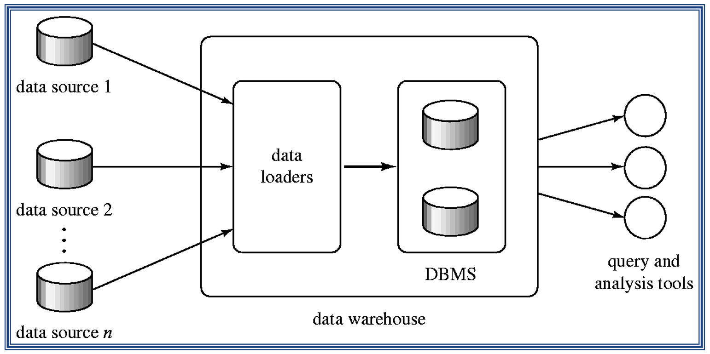
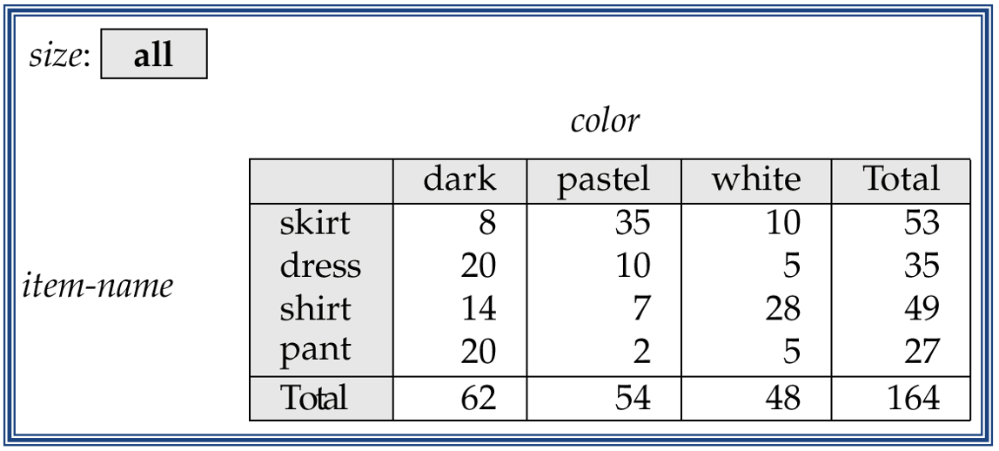
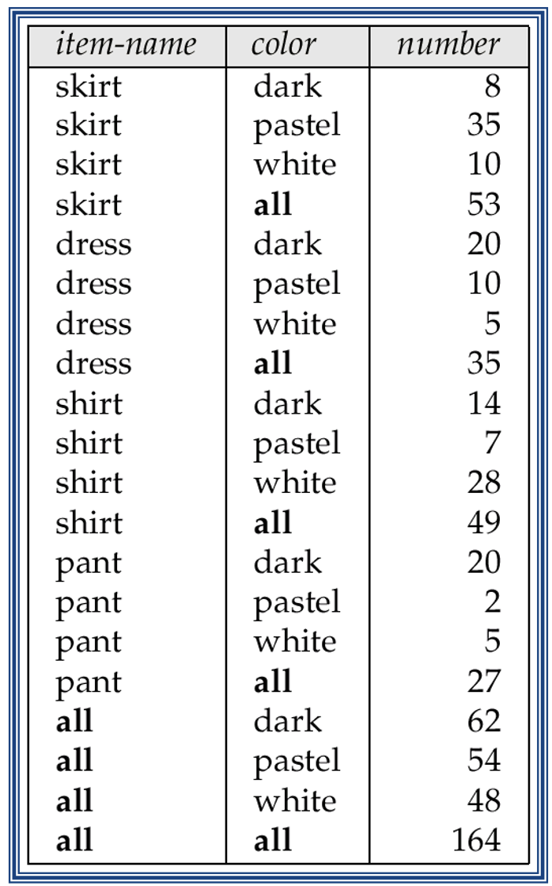
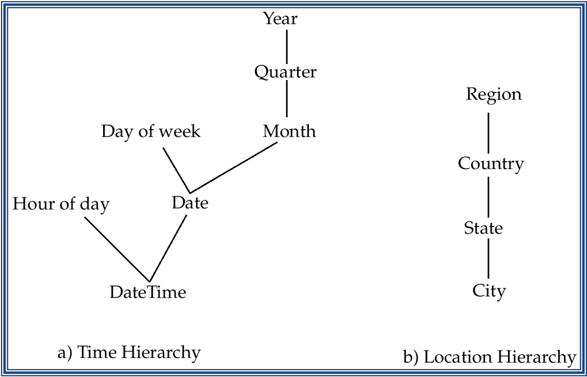
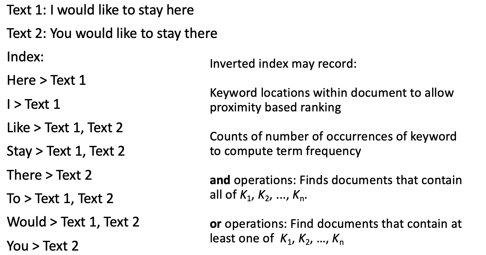
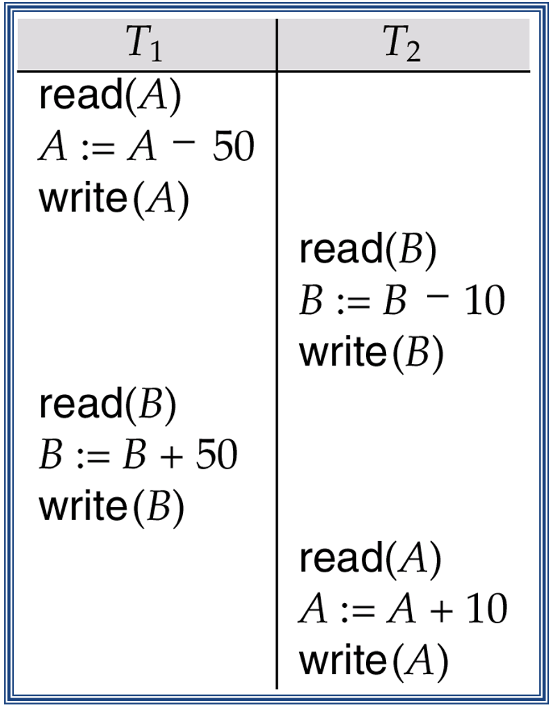
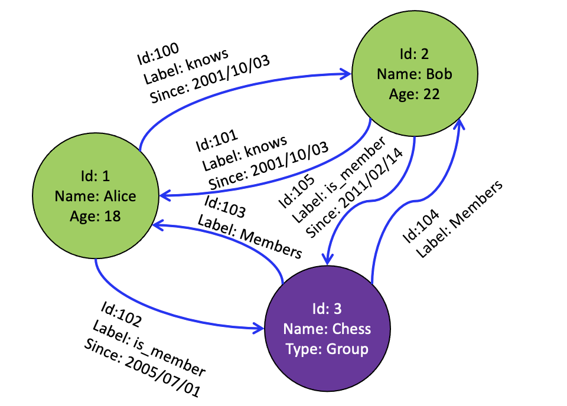
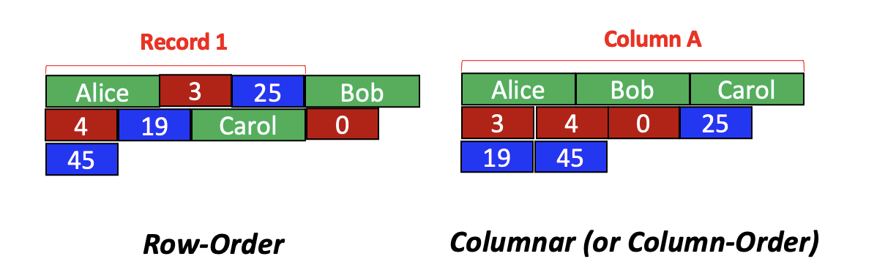

# Lecture 18 - 19

## Data warehousing

* Data sources often store only current data, not historical data
* Corporate decision making requires a unified view of all organizational data, including hsitorical data
* Data warehouse: A data warehouse is a repository/archive of information gathered from multiple sources, stored under a unified schema, at a single site
    * greatly simplifies querying, permits study of historical trends
    * Shifts decision support query load away from transaction processing systems
    
* Architecture:
    > 
  
### Data Warehouse Design Issues
* When and how to gather data:
    * Source driven architecture: Data sources transmit new information to warehouse, either continuously or periodically
    * Destination driven architecture: Warehouse periodically requests new information from data sources
    * Keeping warehouse exactly synchronized with data sources with data sources using two-phase commit is too expensive
        * Usually OK to have slightly out-of-date data at warehouse
        * Data/updates are periodically downloaded form online transaction processing(OLTP) systems.
    
* What schema to use:
    * Schema integration
    
* Data cleansing:
    * E.g. correct mistakes in addresses, misspellings, zip code errors
    * Merge address lists from different sources and purge duplicates
    
* How to propagate updates:
    * Warehouse schema may be a materialized view of schema from data sources
    
* What data to summarize:
    * Raw data may be too large to store
    * Aggregate values often suffice
    * Queries on raw data can often be transformed by query optimizer to use aggregate values
    
## Online Analytical Processing

* OLAP:
    * Online Analytical Processing
    * Interactive analysis of data, commonly for data analysis
    * Data to be summarized and viewed in different ways with negligible delay
    * Extremely difficult to do with OLTP with raw database tables
    
* Data that can be modeled as "dimension attributes and measure attributes" are called multidimensional data:
    * Measure attributes:
        * Measure some values
        * Can be aggregated upon
        * E.g. The attributes `number` of the `sale` relation
    
    * Dimension Attributes:
        * Define the dimensions on which measure attributes or aggregates thereof are viewed
        * E.g. The attributes `item_name`, `color`, and `size` of the `sales` relation
    
### Cross Tabulation of `sales` by `item-name` and `color`

* Cross Tabulation result:
    > 
  
* The table is an example of a cross-tabulation, also referred to as a pivot-table
* Values for one of the dimension attributes form the row headers
* Values for another dimension attribute form the column headers
* Other dimension attributes are listed on top
* Values in individual cell are aggregates of the values of the dimension attributes that specify the cell
* Relational Representation of Cross-Tabulation:
    > 
    * Use the value `all` to represent aggregates
    
### Data Cube

* A data cube is a multidimensional generalization of a cross-tab
* Can have `n` dimensions
* Cross-tabs can be used as views on a data cube

### OLAP Usage

* Pivoting: Changing the dimensions used in a cross-tab
* Slicing: Creating a cross-tab for fixed values only
    * Sometimes called dicing, particularly when values for multiple dimensions are fixed
    
* Rollup: Moving from finer-granularity data to a coarser granularity
* Drill down: The opposite operation to rollup. Moving from coarser-granularity data to finer-granularity data

### Hierarchies on Dimensions

* Hierarchy on dimension attributes: Lets dimensions to be viewed at different levels of detail
* E.g.:
    > 
    
    * The dimension `DateTime` can be used to aggregate by hour of day, date, day of week, month, quarter or year
    
### Cross Tabulation with Hierarchy

* Cross-tabs can be easily extended to deal with hierarchies
    * Can drill down or roll up on a  hierarchy
    
### OLAP Implementation

* The earliest OLAP systems used multidimensional arrays in memory to store data cubes, and are referred to as multidimensional OLAP(MOLAP) systems
* OLAP implementation using only relational database features using rows and columns and no precalculated data cubes called relational OLAP(ROLAP) systems
* Hybrid systems, which store some summaries in memory and store the base data and other summaries in a relational database, are called hybrid OLAP(HOLAP) systems
* Early OLAP systems precomputed all possible aggregates in order to provide online response
* Space and time requirements for doing so can be very high:
    * It suffices to precompute some aggregates, and compute others on demand from one of the precomputed aggregates
    * Several optimizations available for computing multiple aggregates
    
## Information Retrieval Systems

* Information retrieval systems use a simple data model than database systems:
    * Information organized as a collection of documents
    * Documents are unstructured, no schema like OLTP
    * Information retrieval locates relevant documents, on the basis of user input such as keywords or example documents
        * E.g. Find documents containing the words "OLTP systems"
    * As such querying is much more focussed
    * Can be used even on textual descriptions provided with non-textual data such as images
    * Web search engines are the most familiar example of IR systems
    * Run much faster than DBMS for the purpose they were built
    
* Difference from database systems:
    * IR systems don't deal with transactional updates, including concurrency control and recovery
    * Database systems deal with structured data, with schemas that define the data organization
    * IR systems deal with some querying issues not generally addressed by database systems
        * Approximate searching by keywords
        * Ranking of retrieved answers by estimated degree of relevance
    
### Indexing of Documents in IR

* Inverted indices are used in this domain
* E.g.: 
    > 
  
## In-memory Databases

* High-performance hardware and parallelism help improve the rate of transaction processing, but are insufficient to obtain very high performance:
    * Disk I/O is still a bottleneck
    * Parallel transactions may attempt to read or write the same data item,resulting in data conflicts that reduce effective parallelism
    
* Can reduce the degree to which a database system is disk bound by increasing the size of the database buffer

### Main Memory and Databases

* Commercial 64-bit systems can support main memories of tens of gigabytes which is adequate for many databases
* Memory resident data allows for faster processing of transactions
* Further considerations:
    * Logging is a bottleneck when transaction rate is high which needs a consideration
    * Using group-commit can reduce number of output operations
    * If the update rate for modified buffer blocks is high, the disk data transfer rate could  become a bottleneck
    * If the system crashes, all of main memory is lost
    
### Optimizations Opportunities

* To reduce space overheads, use different data structures. E.g. do not use indices built for disks
* No need to pin buffer pages in memory before data are accessed since buffer pages will never be replaced
* Design query-processing techniques to minimize space overhead. Avoid exceeding amin memory limits during query evaluation
* Improve implementation of operations such as locking and latching so they do not become bottlenecks
* Optimize recovery algorithms, since pages rarely need to be written out to make space for other pages

## Group Commit

* Idea: Instead of performing output of log records to stable storage as soon as a transaction is ready to commit, wait until:
    * Log buffer is full
    * A transaction has been waiting sufficiently long after being ready to commit
    
* Results in fewer output operations per committed transaction, and correspondingly a higher throughput
* However, commits are delayed until a sufficiently large group of transactions are ready to commit, or a transaction has been
    waiting long enough-leads to slightly increased response time
  
* Above delay acceptable in high-performance transaction systems since log buffer blocks will fill up quickly

## Real-Time Transaction Systems

* In systems with real-time constraints, correctness of execution involves both database consistency and the satisfaction of deadlines
    * Hard deadline: Serious problems may occur if task is not completed within deadline
    * Firm deadline: The task has zero value if it completed after the deadline
    * Soft deadline: The task has diminishing value if it is completed after the deadline
    
* The wide variance of execution times for read and write operations on disks complicates the transaction management problem
    for time-constrained systems:
    * In-memory databases are thus often used
    * Waits for locks, transaction aborts, contention for resources remain as problems even if data is in main memory
    
* Design of a real-time system involves ensuring that enough processing power exists to meet deadline without requiring excessive hardware resources

## Long Duration Transactions

* Traditional concurrency control techniques do not work well when user interaction is required:
    * Long duration: Design edit sessions are very long. E.g. CAD systems
    * Exposure of uncommitted data: E.g. Partial update to a design
    * Subtasks: Support partial rollback
    * Recoverability: On crash state should be restored even for yet-to-be committed data, so user work is not lost
    * Performance: Fast response time is essential so user time is not wasted
    
* Techniques to deal with long duration transactions:
    * Nested transactions and multilevel transactions are used
    * Use variants of multi-version concurrency control schemes
    * Use concepts beyond serializability for concurrency
    * Use database consistency constraints as to split the database into subdatabases on which concurrency can be managed separately
    
* Novel Concurrency Control:
    * No a serializable schedule but preserves the sum of `A + B`
    * Need to understand semantics more
    > 
  
### Compensating Transactions

* Alternative to undo operation. Compensating transactions deal with the problem of cascading rollbacks
* Instead of undoing all changes made by the failed transaction, action is taken to compensate for the failure
* Consider a long-duration transaction Ti representing a travel reservation, with subtransactions Ti,1, which makes airline reservations,
    Ti,2 which reserves rental cars, and Ti, 3 which reserves a hotel room:
    * Hotel cancels the reservation
    * Instead of undoing all of Ti, the failure Ti, 3 is compensated for by deleting the old hotel reservation and making a new one
    * Requires use of semantics of the failed transaction
    
### Implementation Issues

* For long-duration transactions to survive system crashes, we must log not only changes to the database, but also changes to internal system
    data pertaining to these transactions
  
* Logging of updates is made more complex by physically large data items (CAD design, document text); Undesirable to store both old and new values
* Two approaches to reducing the overhead of ensuring the recoverability of large data items:
    * Operation logging. Only the operation performed on the data item and the data-item name are stored in the log
    * Logging and shadow paging. Use logging for small data items; Use shadow paging for large data items.
    
## OLTP and NoSQL Databases

* Used with big data
* Things are simplified
* Loose consistency
* NoSQL Database types:
    * Document Stores
    * Graph Databases
    * Key-Value Stores
    * Columnar Databases
    
### Document Stores

* Documents are stored in some standard format or encoding. E.g. XML, JSON, PDF or Office Documents
* These are typically referred to as Binary Large Objects (BLOBs)
* Documents can be indexed, adn in their own way
* This allows document stores to outperform traditional systems
* e.g. MongoDB and CouchDB

### Graph Databases
* Data are represented as vertices and edges
* E.g. Architectures:
    > 
  
* Graph databases are powerful for graph-related queries. E.g. find the shortest path between two elements
* Specialized algorithms for such special queries outperforms classical systems
* E.g. Neo4j and VertexDB

### Key-Value Stores

* Keys are mapped to more complex values 
* Keys can be stored in  a hash table and cen be distributed easily
* Such stores typically support regular CRUD operations
* That is there is a simplification with no joins and aggregate functions
* E.g. Amazon DynamoDB and Apache Cassandra

### Columnar Databases

* Columnar databases are a hybrid of RDBMS and Key-Value stores
* Values are stored in groups of zero or more columns, but in Column-Order
* Comparison between Row-Order and Column-Order:
    > 
  
* Fast if you are not accessing individual records but need columns
* Used in data analysis tasks
* E.g. HBase and Vertica

### Limitation of Distributed Databases at Large and Practical Fast Systems

* The limitations of distributed databases can be described in the so called the CAP Theorem:
    * Consistency: Every node always sees the same data at any given instance
    * Availability: The system continues to operate, even if nodes crash, or some hardware or software parts are down due to upgrades
    * Partition Tolerance: The system continues to operate in the presence of network partitions
    
* CAP Theorem: Any distributed database with shared data, can have at most two of the three desirable properties: Consistency, Availability, and Partition Tolerance
* Assuming that two nodes on opposite sides of a network partition:
    * Availability + Partition Tolerance forfeit Consistency as changes in place cannot be propagated when the system is partitioned
    * Consistency + Partition Tolerance entails that one side of the partition must act as if it is unavailable, thus forfeiting Availability
    * Consistency + Availability is only possible if there is no network partition, thereby forfeiting Partition Tolerance
    
### Availability Dominates

* When company such as Google and Amazon were designing large-scale databases, 24/7 availability was a key since a few minutes of downtime means lost revenue
* With databases in 1000s of machines, the likelihood of a node or a network failure increases tremendously
* Therefore, in order to have strong guarantees on availability and Partition Tolerance they had sacrifice strict Consistency

### Other Types of Consistency

* Strong Consistency: After the update completes, any subsequent access will return the same update value
* Weak Consistency: It is not guaranteed that subsequent accesses will return the updated values
* Eventual Consistency: Specific form of weak consistency. It is guaranteed that if no new updates are made to object, eventually all accesses
    will return the last updated values
  
* Causal Consistency: Processes that have casual relationship will see consistent data
* Read-your-write Consistency: A process always accesses the recent data after it's update operation and never sees an older value
* Session Consistency: As long as session exists, system guarantees read-your-write consistency
* Monotonic Read Consistency: If a process has seen a particular value of data item, any subsequent processes will never return any previous values
* Monotonic Write Consistency: The system guarantees to serialize the writes by the same process
* In applications:
    * A number of these properties can be combined
    * Monotonic reads and read-your-writes are most desirable
    
* Example of Eventual Consistency: Dropbox
    * Dropbox enabled immediate consistency via synchronization in many cases
    * Dropbox embraces eventual consistency:
        * Immediate consistency is impossible in case of a network partition
        * Users will feel bad if their word documents freeze each time they hit Ctrl+S, simply due to the large latency to update all devices across WAN
        * Dropbox is oriented to personal syncing, not on collaboration though.
    
### Trading-off Consistency

* Maintaining consistency should balance between the strictness of consistency versus availability/scalability
* Good-enough Consistency depends on your application
    * Loose Consistency: Easier to implement and is efficient
    * Strict Consistency: Generally hard to implement and is inefficient
    
### The BASE Properties

* The CAP theorem shows that it is impossible to guarantee strict consistency and availability while being able to tolerate network partitions
* This resulted in databases with relaxed ACID guarantees
* In particular, such databases, apply the BASE properties:
    * Basically Available: The system guarantees Availability
    * Soft-State: The state of the system may change overtime
    * Eventual Consistency: The system will eventually become consistent