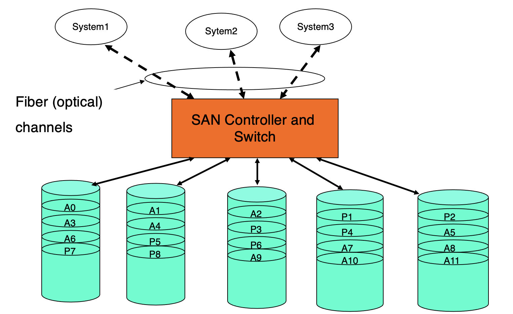
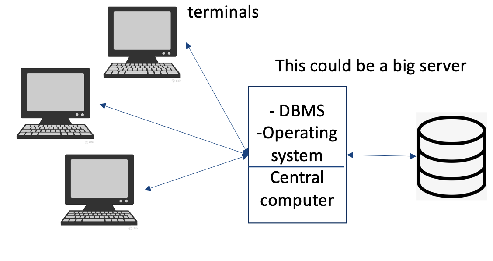
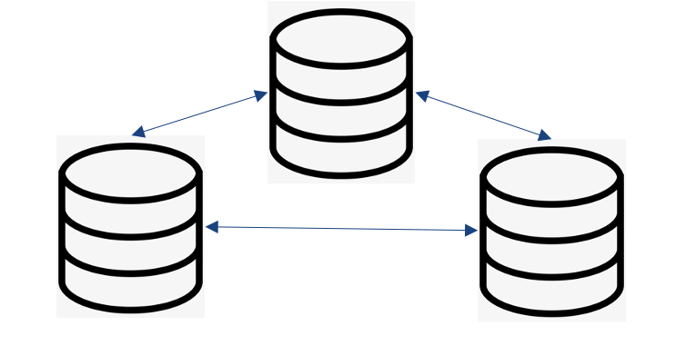
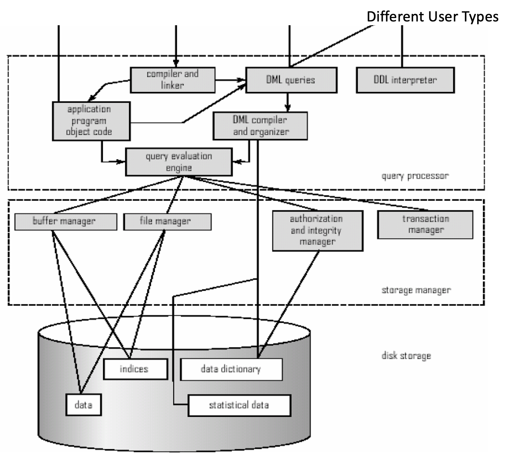
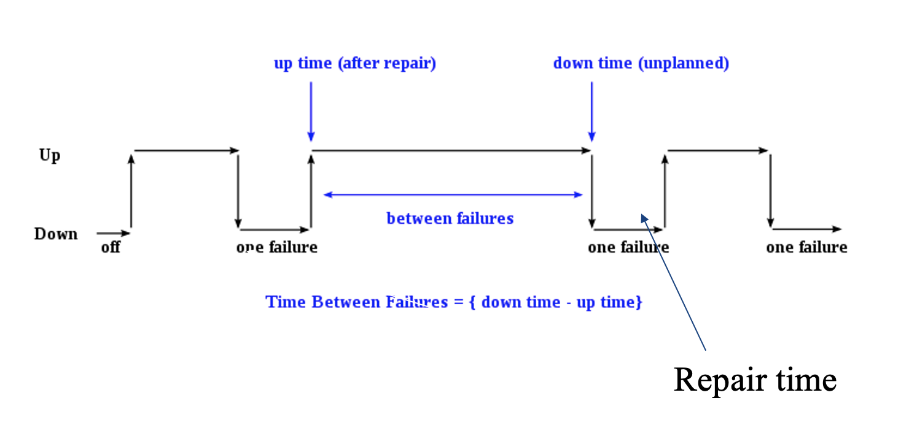
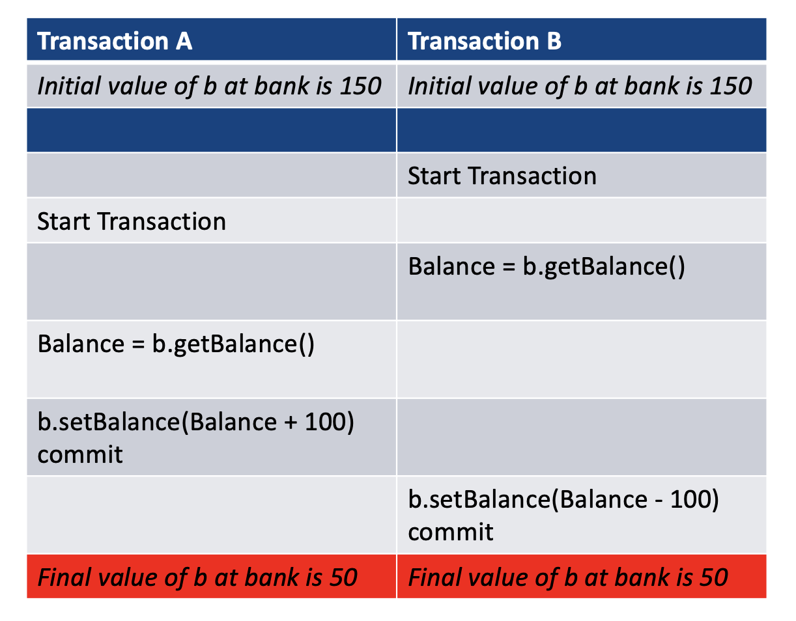
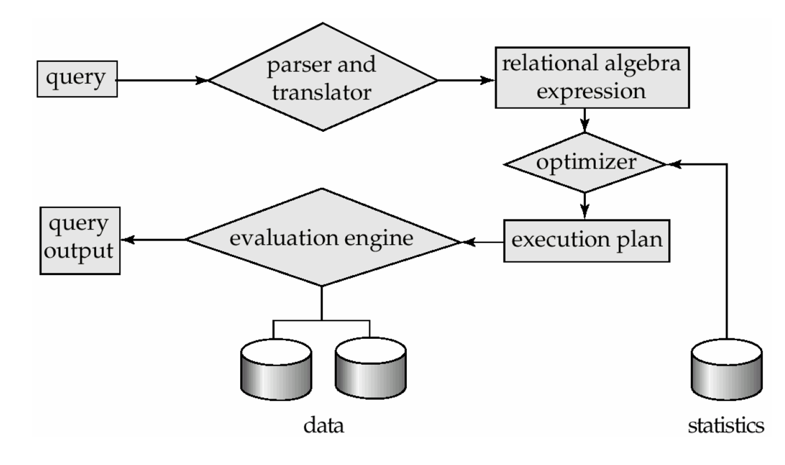
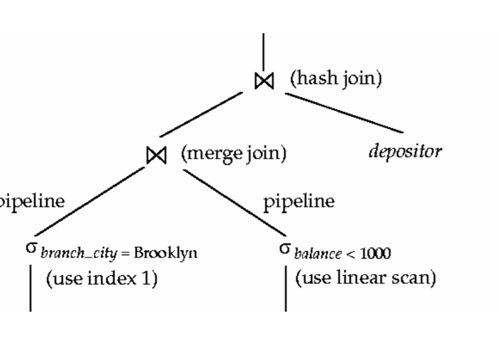
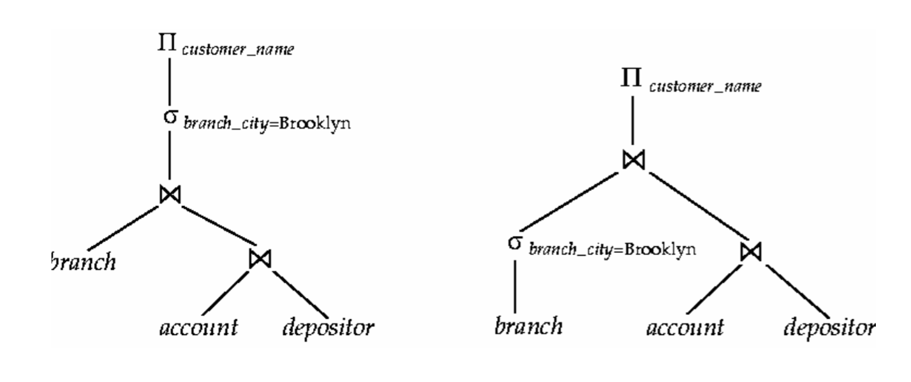

# Lecture 3-4

## Storage Systems

* Storage systems can determine the performance  and fault tolerance of a database
* In database management systems, rarely data is stored on a simple single hard disk
* Storage is commonly much larger, involves multiple disks, and accessed over a network

### Storage Area Networks(SAN)

* A dedicated network of storage devices
* Storage can be organized as RAID(Redundant Array of Inexpensive Disks) Systems
* Storage is partitioned and allocated to each system and can also be shared
* Sample architecture:
    > 
  
* SANs are used for shared-disk file systems
* Allow for automated backup functionality
* Was the fundamental storage for data center type systems with mainframes for decades
* Different versions evolved over time to allow for more data but fundamentals are the same today
* Came with their own networking capabilities
* Failure probability of one disk is different to hundreds of disks which requires design choices

### Communication Costs

* Communication cost: The cost of data transfer:
    `transmit time = (distance / c) + (message bits / bandwidth) where c = speed of light with fibre optics`
  
* This means we can no longer reduce latency on contemporary hardware further and increasingly the motto is that <b>message length should be large to achieve better utilization</b>
* Like disk seek time, latency is something to avoid

## Database Architectures

* [Centralized](#centralized): Data is stored in one location
* [Distributed](#distributed): Data distributed across several nodes, can be in different locations
* [World Wide Web](#WWW): Stored all over the world, several owners of the data, little organization
* [Grid](#grid): Similar to distributed, but each node manages own resources but there is structure
* [P2P](#p2p): Like Grid, but nodes can join and leave network at will
* [Cloud](#cloud): Generalization of grid, but resources are accessed on-demand, run by a company

<h3 id="centralized">Centralized Database Systems</h3>

* Data in one location
* System administration is simple
* Optimization process is generally very effective with simple transactions
* Illustration:
    > 
  
* Many centralized systems use a Client-Server architecture:
    * A central server with a central database in one location. Client and server can be in different locations
    * Client generally provides user interfaces for input and output
    * Server provides all necessary database functionality 
    * System administration is relatively simple 
    * System recovery is also simple
    
<h3 id="distributed">Distributed Database System</h3>

* Data is distributed across several nodes in different locations
* Nodes are connected by network
* System provides very advanced concurrency, recovery and other transaction processing capabilities
* System administration is very hard
* Crash recovery is complicated
* There is usually data replication, potential inconsistency issues
* Illustration:
    > 
  
<h3 id="WWW">Word Wide Web</h3>

* Data is stored in many locations
* Several owners of data - no certainty of data availability or consistency
* Optimization process is generally very ineffective
* Evolving database technology: no standards have developed except in case of XML/http and some protocols for accessing data
* Security could be potential problem
* Notions of transactions is much more difficult to enforce or nonexistent

<h3 id="grid">Grid Computing and Databases</h3>

* Very similar to distributed database systems
* Data and processing are shared among a group of computer systems which may be geographically separated
* Usually designed for particular purpose. E.g. scientific data management, and the grid is dedicated to that purpose
* Administration of such systems are done locally by each owner of the system but there is some protocol/structure
* Reliability, security of such systems are not well-developed or studies.
* Grid systems became quickly outdated by the Cloud Computing Model

<h3 id="p2p">P2P Databases</h3>

* Data and processing is shared among a group of computers which are commonly geographically separated and form a large set
* Computer nodes can join and leave the network at will unlike in Grid Databases. This leads to much harder design transaction models
* Usually designed for particular usage. E.g. Scientific applications
* Administration of such system is done by the owners of each PC
* Did not really take of beyond simple file sharing due to complexities involved.

<h3 id="cloud">Cloud Computing-based Database System</h3>

* Cloud Computing offers online computing, storage and a range of new services for data and devices thar are accessible through the Internet
* User pays for the services just like phone services, electricity
* Large potential with minimal infrastructure costs
* Dynamicity of the resources is a challenge for transactional models
* Cloud services are offered in several forms:
    * IaaS: Infrastructure as a service, provide virtual machines
    * PaaS: Platform as a service, provide environment like Linux, Windows
    * SaaS: Software as a service, also known as DBaaS where database management system is there already
    
* Attributes of Cloud Computing:
    * No capital expenditure
    * Pay as you go and pay only for what you use
    * True elastic capacity. Scale up and down
    * Improves time to market
    * You get to focus your engineering resources on what differentiates you vs. managing the undifferentiated infrastructure resources

## Relational Database

### Relational Database Architecture

> 

### Transaction Processing at core of Relation Databases

* Transaction: A transaction is a collection of operations that need to be performed as a complete unit
* Structure of a transaction:
```
    begin_Transaction()
        ......
        <Sequence of operations to be performed>
        ......
      if (successful)
        commit_Transaction() # Any changes made durable
      else rollback()        # Any changes made are all undone
    end_Transaction()
```

### ACID Properties

* Any transaction is relied on the ACID properties
* <b>Atomicity</b>: A transaction's changes to the state(Database) are atomic implying either all actions happen or none happen
* <b>Consistency</b>: Transaction are a correct transformation of the state.
    * Actions taken as a whole by a transaction do not violate the integrity of the state. That is we are assuming transactions are correct programs
    
* <b>Isolation</b>: Even when several transactions are executed simultaneously, it appears to each transaction `T` that others executed either happened before `T` or after `T` but not at the same time
    * Concurrent execution of transactions should not violate consistency of data    

* <b>Durability</b>: State changes committed by a transaction survive failures

### Required Features of a Database System

* None of the ACID properties are trivial to achieve
* Despite adversarial conditions database management system should:
    * Fast access to large amounts of data
    * Provide a secure and stable repository when things fail
    * Provide standard interfaces to data definition and manipulation
    * Help multiuser accesses are done in an orderly manner
    * Allow convenient ways for report production and browsing
    * Ease in loading data, archiving, performance tuning
    
### System Lifecycle

* Illustration:
    > 
  
* E.g. HDDs have about 10 years to malfunction. If you have 360 HDDs in a SAN (assuming independent failures at uniformly random distribution), then one failure about every 10 days. Assuming it takes 1 day the failed unit use the following:
    * Module availability: Measures the ratio of service accomplishment to elapsed time
        `Module availablilty = Mean time to failure / Mean time to failure + mean time to repair`
    * In the example: 10/11 or about 91% availability for the system  
    
### Concurrency Problem of Database System
* E.g.
    > 
  
## Performance and Database Management System

### Query Processing Steps

* Illustration:
    > 
  
### Joins

* A key hurdle to get fast query processing
* Written as: 
    *  is used to define a join of two tables on some condition, here `r` and `s` are tables and `&theta;` is the condition like `<`, `>`, and `=`
    
* SQL Example:
    ```sql
    SELECT * 
    FROM T1 INNER JOIN T2 on T1.a = T2.b
    ```
    * Database Management System converts this to a relational algebra
    
* This is very common and also very expensive operation
* A lot of investment gone into doing an efficient join operation on various data types
* Several different algorithms to implement joins exist that the optimizer can look at and pick the best:
    * [Nested-loop join](#simple_nest)
    * [Block nested-loop join](#block_nest)
    * Indexed nested-loop join
    * Merge-join
    * Hash-join
    
* Choice based on cost estimate: statistics, table sizes, available indices
* Decisions effect performance dramatically

<h3 id='simple_nest'>Simple Nested-loop join</h3>

* To compute a &theta; join:
    ```
    for each tuple t_r ub r do begin
        for each tuple t_s in s do begin
            test pair (t_r, t_s) to see if they satisfy the join condition &theta;
            if they do, add t_r * t_s to the result
        end
    end
    ```

* `r` is called the outer relation and `s` the inner relation of the join
* Requires no indices and can be used with any kind of join condition
* Expensive since it examines every pair of tuples in the two relations
* Could be cheap if do it on two small tables where they fit to main memory. Disk brings the whole table with first block access
* Thus building an index would be overkill 
* E.g. with cost calculation:
    * Database information:
        * Number records of `customer`: 10000, `depositor`: 5000
        * Number of blocks of `customer`: 400, `depositor`: 100
    * In the worst case, if there is enough memory only to hold one block of each table, the estimated cost is:
        * n<sub>r</sub> * b<sub>s</sub> + b<sub>r</sub> block transfer
        * n<sub>r</sub> + b<sub>r</sub> seeks
    * With `depositor` as the outer relation:
        * 5000 * 400 + 100 = 2000100 block transfers
        * 5000 + 100 = 5100 seeks
    * With `customer` as the outer relation:
        * 10000 * 100 + 400 = 1000400 block transfers
        * 10000 + 400 = 10400 seeks
    * Assuming average seek time was 12 ms, rotation delay 4 ms, transfer rate 4 MB/sec
        * 10400 * 12 ms seek time which makes about 2 minutes to join two tables
        * If for 1000000 customers, it will take about 3 hours for a simple join query for only seek time
    
<h3 id="block_nest">Block Nested-loop Join</h3>

* Variant of nested-loop join in which every block of inner relation is paired with every block of outer relation
    ```
    for each block B_r of r do begin
        for each block B_s of s do begin
            for each tuple t_r in B_r do begin
                for each tuple t_s in B_s do begin
                    Check if (t_r, t_s) satisfy the join condition
                    if thet do, add t_r * t_s to the result
                end
            end
        end
    end
    ```
  
* E.g. Cost Computation
    * b<sub>r</sub> * b<sub>s</sub> + b<sub>r</sub> block transfers
    * 2 * b<sub>r</sub> seeks
    * Each block in the inner relation `s` is read once for each block in the outer relation instead of once for each tuple in the outer relation
    * In the example:
        * 400 * 100 + 400 = 40400 transfers
        * 2 * 400 = 800 seeks
        * 800 * 12 ms about 10 seconds for seek time
    
### Query Optimization

* Query optimization is all about the right choices and annotations
> 

* Steps in cost-based query optimization:
    1. Generate logically equivalent expressions of the query
    2. Annotate resultant expressions to get alternative query plans
    3. Choose the cheapest plan based on estimated cost
    
* Estimation of plan cost based on:
    * Statistical information about tables: E.g. numbers of distinct values for an attribute
    * Statistics estimation for intermediate results to compute cost of complex expressions
    * Cost formulae for algorithms, computed using statistics again
    
* E.g. of equal expressions:
    > 
  
* Generate alternatives:
    * Query optimizers user equivalence rules to systematically generate expressions equivalent to the given expression
    * SQL does not give this power and hence relational algebra is use which is procedural
    * One can generate all equivalent expressions exhaustively
    * Every expensive in space and time though
    
* Caveat:
    * Must consider the interaction of evaluation techniques when choosing evaluation plans
    * Choosing the cheapest algorithm for each operation independently may not yield the best overall algorithm
        * E.g merge-join may be costlier than hash-join, but my provide a sorted output which could be useful later
    * Practical query optimizers incorporate elements of the following two broad approaches:
        * Search all the plans and choose the best plan in a cost-based fashion
        * Uses heuristics to choose a plan
    
* In real-life implementation, cost-based optimization is expensive. So system may use heuristics to reduce the number of choices that must be made in a cost-based fashion
    * Heuristic optimization transforms the query-tree by using a set of rules that typically improve execution performance:
        1. Perform selections early -> Reduces the number of tuples
        2. Perform projections early -> Reduces the number of attributes
        3. Perform most restrictive selection and join operations before other similar operations
    * Some systems use only heuristics, other combine heuristics with cost-based optimization.
    * Optimizers often use simple heuristics for very cheap queries, and perform exhaustive enumeration for more expensive queries. 