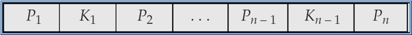
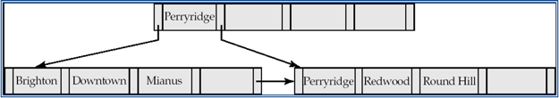
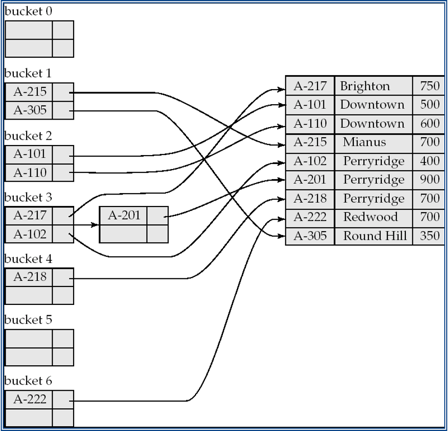
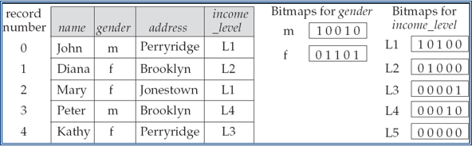
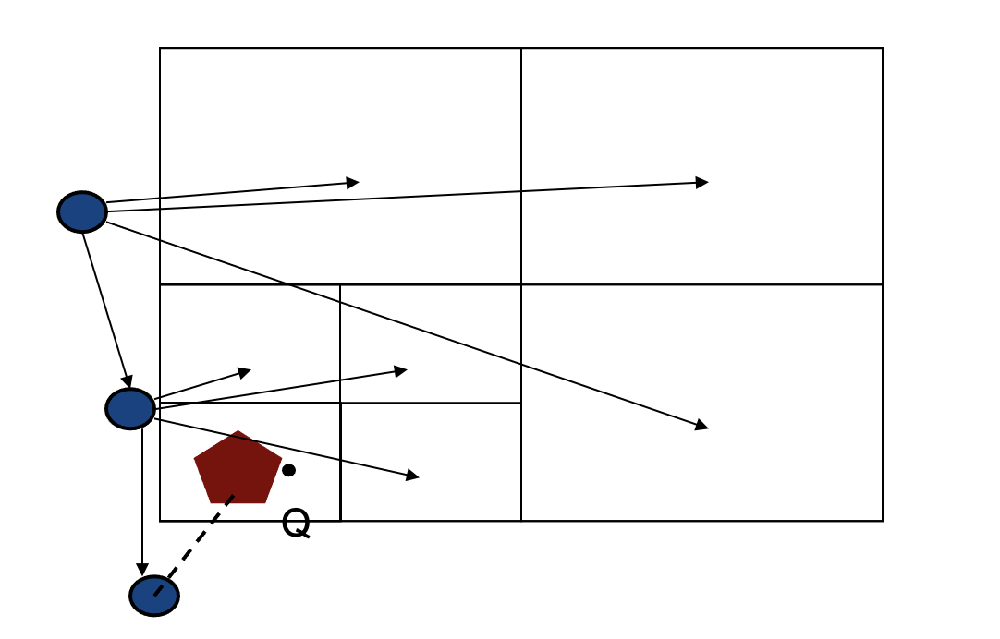
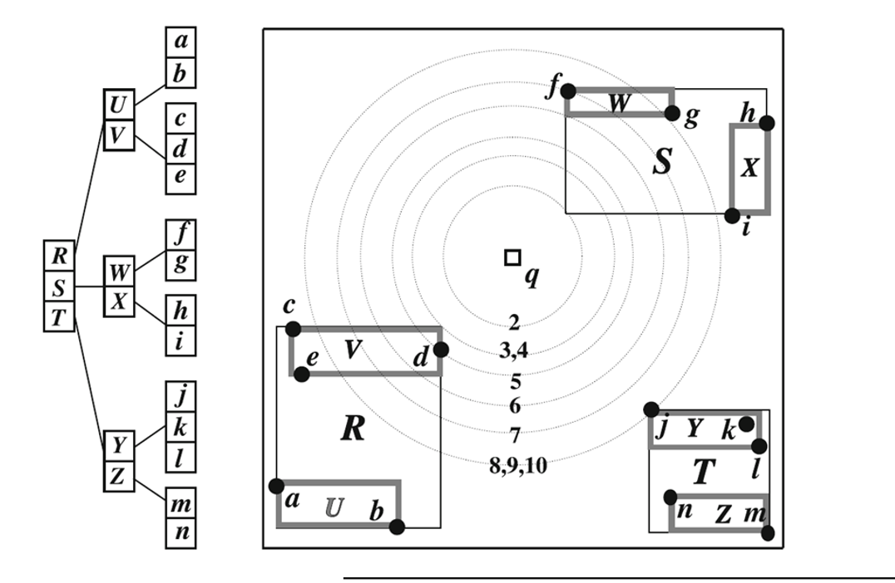
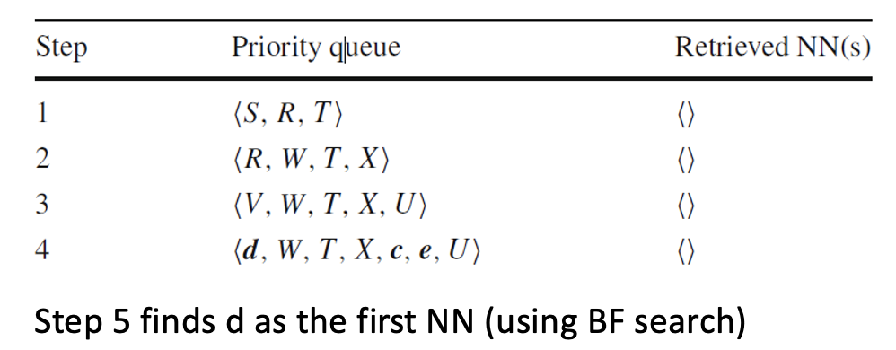

# Lecture 5

## Indexing

### Indexing is Critical for Efficiency

* Indexing mechanisms used to speed up access to desired data in a similar way to look up a phone book
* Search Key: Attribute or set of attributes used to look up records/rows in a system like an ID of a person
* Index file: An index file consists of records of the form called index entries and pointer to where data is called search key
* Index files are typically much smaller than the original data files and many parts of it are already in memory
* Two basic kinds of indices:
    * Ordered indices: Search keys are stored in some order
    * Hash indices: Search keys are distributed hopefully uniformly across buckets using a hash function
    
* Indexing speeds up the database management system in many aspects:
    * Disk access become faster through:
        * Records with specified value in the attribute accessed with minimal disk accesses
        * Records with an attribute value falling in a specified range of values can be retrieved with a single seek and then consecutive sequential reads
    * Insertion and deletion time to index are also speed up
    * No big index rearrangement after insertion and deletion
    * Space overhead has to be considered for the index itself
    
### Index types

* Primary index: In a sequentially ordered file, the index whose search key specifies the sequential order of the file
    * The search key of a primary index is usually but not necessarily the primary key
    
* Secondary index: An index whose search key specifies an order different from the sequential order of the file

## B+ Trees

* The most popular data structure for constructing the index
* Why:
    * Keeping files in order for fast search ultimately degrades as file grows, since many overflow blocks get created
    * Binary search on ordered files cannot be done
    * Periodic reorgranization of entire files is required to achieve this.
* Similar to Binary Tree in that aspect but the fan out is much higher    
* Advantages of B+ tree index files:
    * Automatically reorganizes itself with small, local, changes, in the face of insertions and deletions
    * Reorganization of entire file is not required to maintain performance
    
* Disadvantages of B+ Trees:
    * Extra insertion and deletion overhead and space overhead
    
* Advantages of B+ Trees outweigh disadvantages, therefore B+ trees are sued extensively

### B+ Tree Architecture

* It is similar to a binary tree in concept but with a fan out that is defined through a number n
* All paths from root to leaf are the same length, which means the tree is a full tree
* Each node that is not a root or a leaf has between &LeftCeiling;n /2&RightCeiling; and n children
* A leaf node has between &LeftCeiling;(n - 1) / 2&RightCeiling; and n - 1 values
* Special cases:
    * If the root is not a leaf, it has at least 2 children
    * If the root is a leaf, that is there are no other nodes in the tree, it can have between 0 and n - 1 values
    
* A single node:
    * 
    * K<sub>i</sub> are the search-key values
    * P<sub>i</sub> are pointers to children (for non-leaf nodes) or pointers to records or buckets of records (for leaf nodes)
    * The search keys in a node are ordered: K<sub>1</sub> < K<sub>2</sub> < K<sub>3</sub> < ... < K<sub>n-1</sub>
    
* Most of the higher level nodes of a B+ tree would be in main memory already

* E.g. of B+ Tree:
    > <br>
    > B+ Tree for account file with n = 5
  
    * Leaf nodes must have between 2 and 4 values (&LeftCeiling;(n - 1) / 2&RightCeiling; and n - 1 with n = 5)
    * Non-leaf nodes other than the root must have between 3 and 5 children (&LeftCeiling;n /2&RightCeiling; and n with n = 5)
    * Root must have at least 2 children
    
### Querying in B+ Tree

* Find all records with a search-key value of k:
    ```
    1. N = root initially
    2. Repeat:
        2.1 Examine N for the smallest search-key value > k
        2.2 If such a value exists, assume it is K_i, then set N = P_i
        2.3 Otherwise k >= K_n-1, set N = P_n
        Until N is a leaf node
    3. If for some i, key K_i = k follow pointer P_i to the desired record or bucket
    4. Else no record with search-key value k exists
    ```
  
* Metrics:
    * If there are K search-key values in the file, the height of the tree is no more than &LeftCeiling;log<sub>&LeftCeiling;n / 2&RightCeiling;</sub>(K)&RightCeiling; and it would be balanced
    * A node is generally the same size as a disk block, typically 4 KB and n is typically around 100
    * With 1 million search key values and n = 100:
        * log<sub>50</sub>(1000000) = 4 nodes are accessed in a lookup
    * In contrast, a balanced binary tree with 1 million search key values is around 20 nodes accessed in lookup
    
## Hash Indices

* A hash index organizes the search keys, with their associated record pointers, into a hash file structure. Order is not important.
* Hash indices are always secondary indices
* Given a key, the aim is to find the related record on file in one shot which is important
* Characteristic of ideal hash function:
    * Uniform: Each bucket is assigned the same number of search-key values from the set of all possible values
    * Random: Each bucket will have the same number of records assigned to it irrespective of the actual distribution of search-key values in the file
* Typical hash functions perform computation on the internal binary representation of the search key

* E.g of architecture:
    > 
  
## Bitmap Indices

* Records in a relation are assumed to be numbered sequentially from 0
* Applicable on attributes that take on relatively small number of distinct values. E.g. Gender, country, state
* Bitmap is simply an array of bits
* E.g.:
    * In its simplest form a bitmap index on an attribute has a bitmap for each value of the attribute
    * Bitmap has as many bits as the records
    * In a bitmap for value v, the bit for a record is 1 if the record has the value v for the attribute, and is 0 otherwise
    * Used for business analysis, where rather than individual records, how much of one type exists is the query 
    * Illustration:
        > 
      
## Indexing for Other Data Types

* Unlike things we can access by names, ids, there is a lot of data that exists and increasingly that requires special idnexing
* E.g. Spatial daa requires complex computations for accessing them like intersections of objects in space
* There is no trivial way to sort items which is the key issues

### Creating Buckets for Spatial Data

* In 2D space, similar to B+ trees to exponentially reduce the number of calculations by a repetitive division of space, novel indices were invented
* E.g. of data structure: 
    * Quadtrees:
        * Illustration:
            > 
          
        * Running NN Query:
            * Best First Search. Just order access with respect to distance to point
        
    * R-tree:
        * Illustration:
            > 
        
        * Running NN Query:
            > 
          
          
## Applications of Indexing

* There are many types of indexing techniques
* In application, given a dataset, when uploading to the database management system
    * Consider potential query types
    * Research what indices that particular database management system would have
    * Research for what data type and queries you would use indexing
    * Create index if you have large data
    * Monitor performance
    * Tune, create other indices