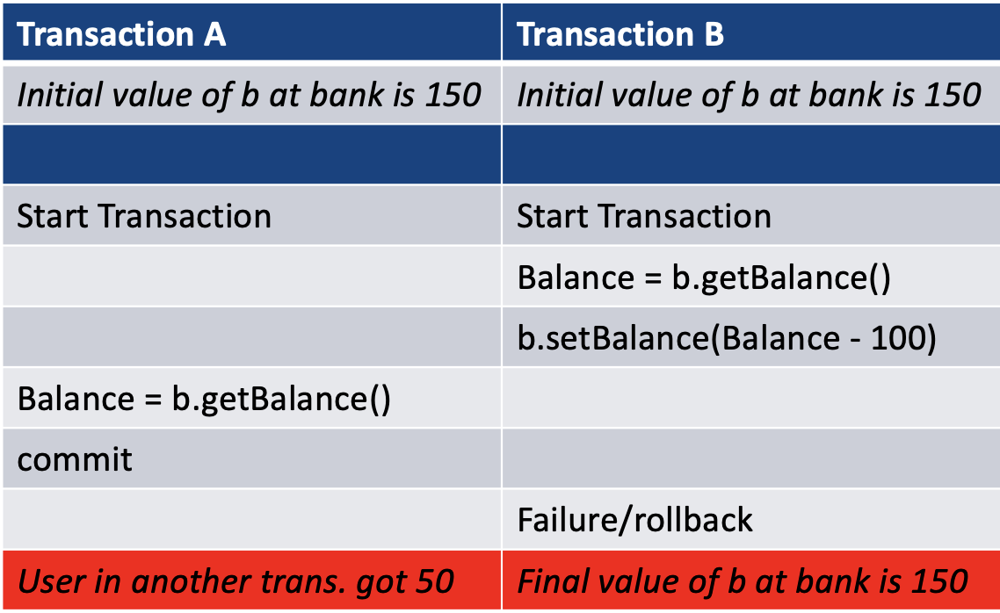
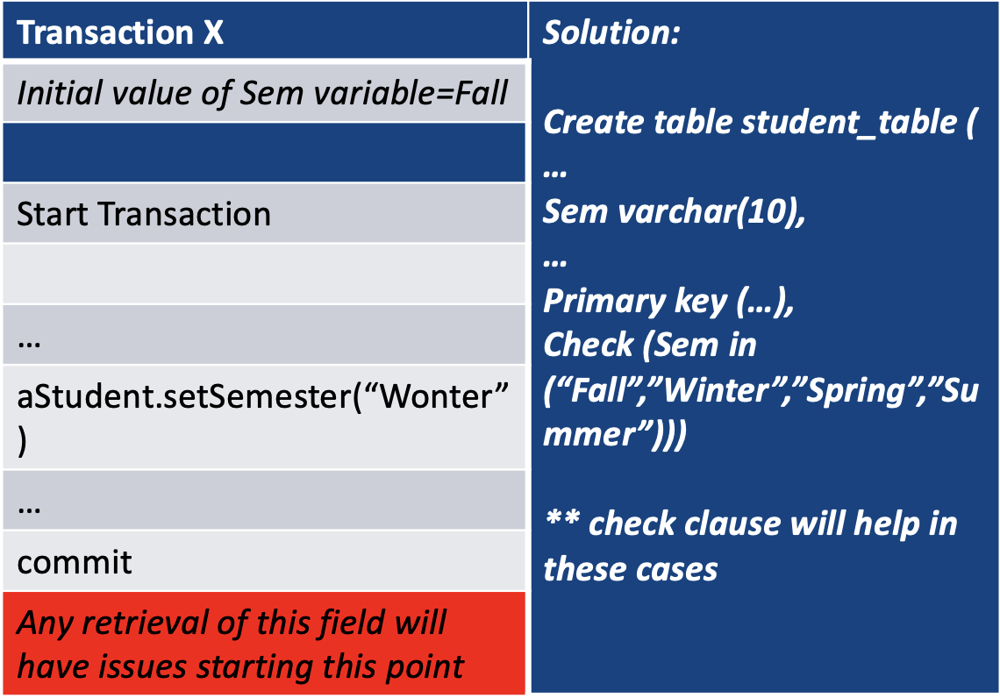
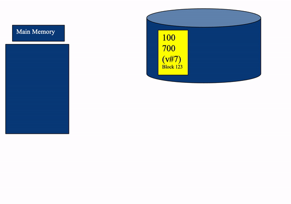
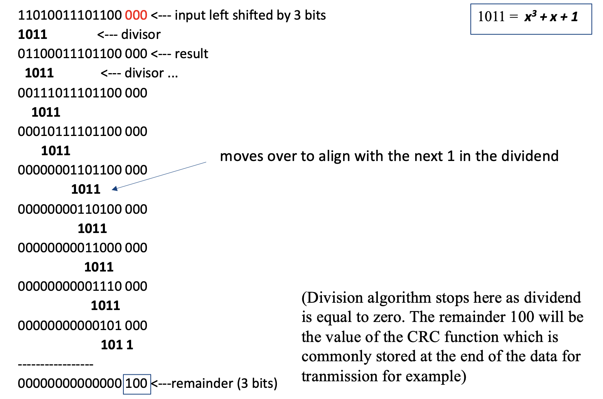
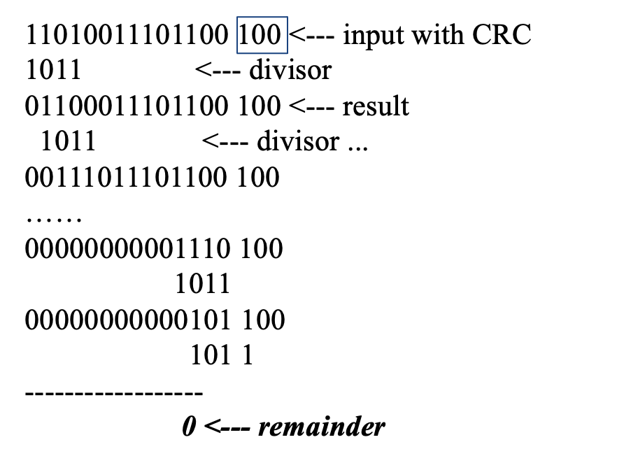
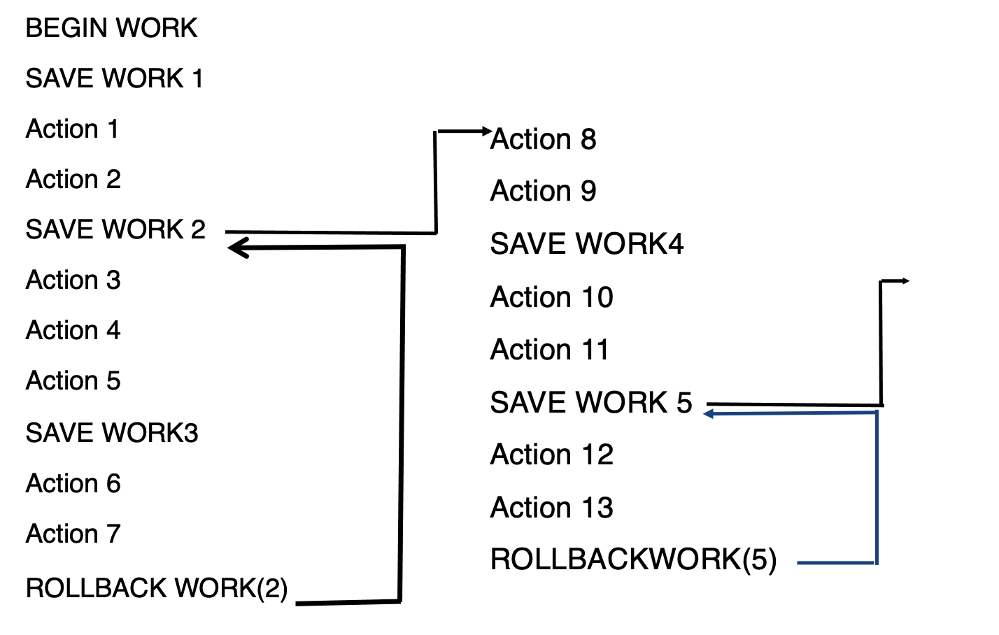
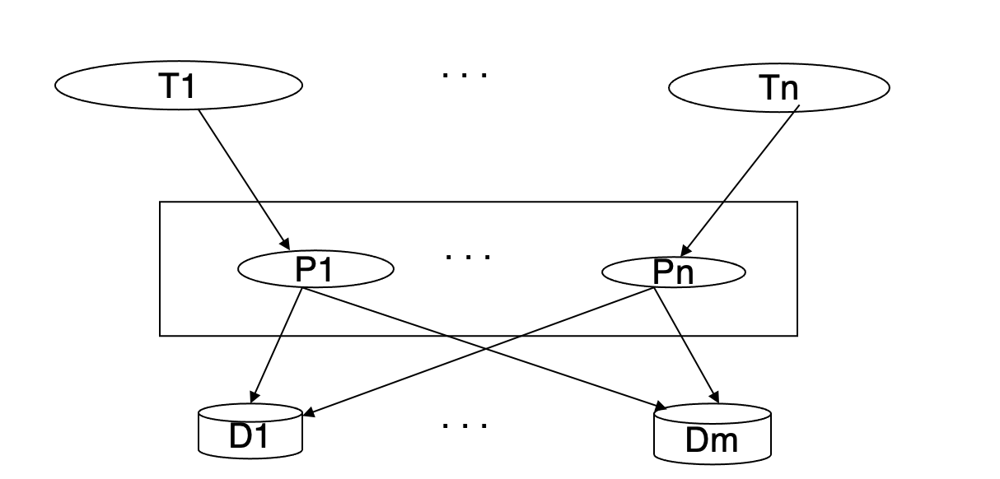
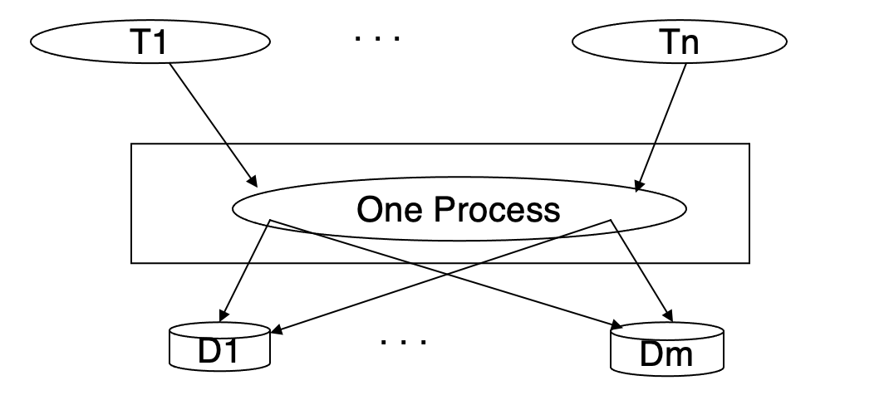
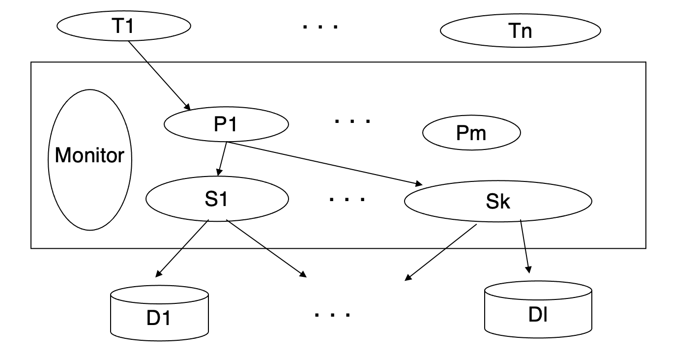

# Lecture 6-7

### Database Transactions

* Transaction is a unit of work in a database which may have multiple SQL queries bundled together
* A transaction can have any number and type of operations in it
* Either all happens as  a whole operations or not. This is the most important factor that makes it an atomic unit of execution
* Transactions is ideally have four properties, commonly known as <b>ACID</b> properties

### Types of Actions

* Unprotected actions: No ACID property, easy to run with weaker guarantees
* Protected actions: These actions are not externalized before they are completely done. These actions are controlled and can be rolled back if required. These have ACID properties guaranteed
* Real actions: There are real physical actions once performed cannot be undone. In many situations, atomicity is not possible at all. Beware if the database is hooked to the real world.


## ACID Properties

* [Atomicity](#Atomicity)
* [Consistency](#Consistency)
* [Isolation](#Isolation)
* [Durability](#Durability)
* Extra Reference: [浅谈 MySQL 的事务和 ACID](https://segmentfault.com/a/1190000021524601)

<h3 id="Atomicity">Atomicity</h3>

* Definition: All changes to data are performed as if they are a single operation. That is, all the changes are performed, or none of them are.
* E.g.: A transaction that contains two actions:
    * Action 1: Subtracts $100 if balance > 100
    * Action 2: Deposits $100 to another account
    * In this transaction, both actions will either happen together or none will happen

* This atomicity is not easy to achieve. For example, what if the system shows the user some data right after each step of the transaction: E.g. right after Action 1 before Action 2
* If a failure in Action 2 cannot be rolled back easily anymore because the user is informed of the transaction status and the system have no control of whether the user is capturing the rollback and thus may take some external action potentially
* Another example:
  > 

    * This schedule of two transactions is not recoverable and will violate the principles of atomicity as well

<h3 id="Consistency">Consistency</h3>

* Definition: Data is in a consistent state when a transaction starts and should be a consistent state when it ends. Any data written to the database must be valid according to all defined rules

* Consistent: Depends on the application and context constraints

* Not easily computable in general

* Only restricted type of consistency can be guaranteed

* Multiple transactions running concurrently can create inconsistent states as well

* E.g.
  > 

    * The transaction is setting the student's `semester` to `wonter` instead of the correct value `winter`.
    * This will cause problems in future queries like querying all students in the winter semester.

<h3 id="Isolation">Isolation</h3>

* Definition: Transactions are executed as if it is the only one in the system

* E.g. In an application that transfers funds from one account to another, the isolation ensures that another transaction sees the transferred funds in one account ot the other, but not in both, nor in neither

* Basically th other transactions should be running in effect as if they came before or after the current transfer transaction. They run in a schedule with this transaction that is equal to one of the serial execution orders given above.

* E.g.
  > 

    * To meet the isolation property, the transactions should be taken either A -> B, or B -> A

* Concurrent execution: There are benefits of running concurrent execution rather than sequential executions which is guaranteed with isolation property:
    * Reduce waiting time: Some transactions may continue on another part of the database while others are running for a long time on one part
    * Improved throughput and resource utilization: Some transaction can do I/O while another runs on CPU. This and other optimization opportunities increase throughput

<h3 id="Durability">Durability</h3>

* Definition: The system should tolerate system failures and any committed updates should not be lost

## Saving Data in Permanent Storage

* Most database management system assume data is in hard disks or other kinds of permanent storage

* Need to ensure things are written and preserved in some way despite failures

* Rule is either entire block is written correctly on disk or the contents of the block is unchanged. To achieve disk write consistency, the duplex writes algorithm should be executed:
    1. Each block of data is written in two places sequentially before done the write work
    2. If one of the writes fail, system can issue another write
    3. Each block is associated with a version number. The block with the latest version number is read from.
    4. While reading, can determine error in a disk block by its [CRC](#CRC) as well

* Logging: A popular version of this paradigm is logging.
    * The first one of the write goes to a log. The second overwrites the old regular data block.
    * All modifications need to be logged before they are applied
    * If a failure occurs, system knows where are left to take the proper action.

* Duplex Writes Illustration:
  > 

<h3 id="CRC">Cyclic Redundancy Check</h3>

* CRC is used historically in communication reliability as well
* Most errors in communications or on disk happen contiguously that is in bursts naturally
* CRC can be used detect burst errors on disks
* CRC generation: To compute an n-bit binary CRC:
    1. Add `n` zero bits as padding to the right of the input bits:
       > Input: 11010011101100 <br>
       Padded: 11010011101100 <span color="red">000</span> <- input left shifted by 3 bits of padding

    2. Compute the `n+1`-bit pattern representing the CRC's divisor given as a polynomial:
       > Polynomial: x<sup>3</sup> + x + 1 <br>
       Written in binary as the coefficients: 1x<sup>3</sup> + 0x<sup>2</sup> + 1x + 1<br>
       Coefficients: 1, 0, 1, and 1

    3. The `n+1`-bit pattern representing the CRC's divisor with the lefthand end of the input bits also shown:
       > 11010011101100 <span color="red">000</span> <- input right padded by 3 bits <br>
       1011 <---------------------- divisor (4 bits) = x<sup>3</sup> + x + 1

    4. The algorithm acts on the bits directly above the divisor in each step
        * The result for each iteration is the bitwise XOR of the polynomial divisor with the bits above it
        * The bit not above the divisor are simply copied directly below for next step
        * The divisor is then shifted one bit to the right and the process is repeated util the bits of the input message becomes zero.
    * Complete CRC Calculation of the example: 
        > 
        
* CRC Checking: The validity of a received message can easily be verified by performing the generation calculation again. This time with the check value added instead of zeros. The remainder should be 0 if there are no detectable errors.
    * E.g.:
        > 
      
      
## Programming Transactions
* E.g. 
    ```c
    int main(){
        /* setup for access to DBMS */
        exec sql BEGIN DECLARE SECTION;
        /* The following variables are used for comunicating between SQL and C */
        int OrderID; /* Employee ID (from user) */
        int CustID; /* Retrieved customer ID */
        char SalesPerson[10] /* Retrieved salesperson name */
        char Status[6] /*Retrieved order status */
        
        exec sql END DECLARE SECTION;
        
        /* set up error procesing */
        exec sql WHENEVER SQLERROR GOTO query_error;
        exec sql WHENEVER NOT FOUND GOTO bad_number;
        
        /* Prompt the user for order number */
        printf("Enter order number: ");
        scanf_s("%d", &OrderID);
        
        /* Execute the SQL query */
        exec sql SELECT CustID, SalesPerson, Status
            FROM Orders
            WHERE OrderID = :OrderID // ":" indicates to refer to C variable
            INTO :CustID, :SalesPerson, :Status;
            
        /* Display the results */
        printf("Customer number: %d\n", CustID);
        printf("Salesperson: %s\n", SalesPerson);
        printf("Status: %s\n", Status);
        exit();
        
        query_error:
            printf("SQL error: %Id\n", sqlca->sqlcode); exit();
        bad_number:
            printf("Invalid order number.\n");exit();    
    }
    ```

* Host variables: Declared in a section enclosed by the `BEGIN DECLARE SECTION` and `END DECLARE SECTION`. 
    * While accessing these variables, they are prefixed by a colon `:`. The colon is essential to distinguish between host variables and database object.
    
* Data Types: The data types supported by a DBMS and a host language can be quite different. Host variables play a dual role:
    * Host variables are program variables, declared and manipulated by host language statements
    * Host variables are also used in SQL to retrieve database data
    * If there is no host language type corresponding to a DBMS data type, DBMS automatically coverts the data. So, the host variable types must be chosen carefully.
    
* Error Handling: The DBMS reports runtime errors to the applications program through an SQL Communication Area (SQLCA) by `INCLUDE SQLCA`.
The `WHENEVER ... GOTO` statement tells the preprocessor to generate error-handling code to process errors returned by the DBMS
  
* Singleton `SELECT`: The statement used to return the data is a singleton `SELECT` statement; That is, it returns only a single row of data. 
Therefore, the code example does not declare or use cursors to go through more outputs.
  
### Flat Transaction

* Put delimiter around multiple statements to make it a transaction
    * Everything inside `BEGIN WORK` and `COMMIT WORK` is at the same level. The transaction will either survive together with everything
      (commit) or it will be rolled back with everything (abort)
    
* E.g.
    ```c
    exec sql BEGIN DECLARE SECTION;
        long AccId, BranchId, TellerId, delta, AccBalance;
    exec sql END DELCARATION;
  
    /* Debit/Credit Transaction */
    DCApplication() {
        read input msg;
        exec sql BEGIN WORK;
        AccBalance = DoDebitCredit(BranchId, TellerId, AccId, delta);
        send output msg;
        exec sql COMMIT WORK;
    }
    
    Long DoDebitCredit(long BranchId, long TellerId, long AccId, long delta){
        exec sql UPDATE accounts
            SET AccBalance = AccBalance + :delta
            WHERE AccId = :AccId;
  
        exec sql SELECT AccBalance INTO :AccBalance
            FROM accounts WHERE AccId = :AccId;
  
        exec sql UPDATE tellers
            SET TellerBalance = TellerBalance + :delta
            WHERE TellerId = :TellerId;
        exec sql UPDATE branches
            SET BranchBalance = BranchBalance + :delta
            WHERE BranchId = :BranchId;
        
        exec sql INSERT INTO history(TellerId, BranchId, AccId, delta, time)
            VALUES (:TellerId, :BranchID, :AccId, :delta, CURRENT);
        
        return(AccBalance);
    }
    ```

* Including a check of the database and rollback :
    ```c
    DCApplication(){
        read input msg;
        exec sql BEGIN WORK;
        AccBalance  = DoDebitCredit(BranchId, TellerId, AccId, delta);
        if (AccBalance < 0 && delta < 0) {
            exec sql ROLLBACK WORK;
        } else {
            send output msg;
            exec sql COMMIT WORK;
        }
    ```
  
* Limitation of Flat Transactions:
    * Flat transactions do not model many real applications
        * E.g. Airline booking:
            ```c
            BEGIN WORK
                S1: book flight from Melbourne to Singapore
                S2: book flight from Singapore to London
                S3: book flight from London to Dublin
            COMMIT WORK    
            ```
        * Problem 1: if we failed to execute S3, we need to udo all.
        * Problem 2: if we roll back we need to redo the booking from Melbourne to Singapore which is a waste for real applications
    * If the transaction is a long transaction. Any failure requires lot of unnecessary recomputation
    
### Flat transaction with save points

* A solution for problems of pure flat transaction

* A savepoint is established by invoking the `SAVE WORK` function which causes the system to record the current state of processing

* This returns to the application program a handle that can subsequently be used to refer to that savepoint. Typically, the handle is a monotonically increasing number

* The only reason why an application program needs an identifier for a savepoint is that it may later want to reestablish that savepoint

* To do that, the application invokes the `ROLLBACK WORK` function, but rather than requesting the entire transaction to be aborted, it passes the number of the savepoint it wants to be restored

* As a result, it finds itself reinstantiated at that very savepoint

* Illustration:
    > 
  
### Nested Transaction
* Rules:
    * Commit Rule: A subtransaction can either commit or abort. However, commit cannot take place unless the parent itself commits. Commit of a subtransaction makes its result available only to its parents.
        * E.g. Subtransactions have `A`, `C` and `I` properties but not `D` property unless all its ancestors commit
    * Rollback Rule: If a subtransaction rolls back, all its children are forced to rollback
    * Visibility Rule: Changes made by a subtransaction are visible to the parent only when the subtransaction commits.
        All objects of parent are visibil to children. Implication of this is that the parent should not modify objects while
        children are accessing them. This is not a problem as parent does not run in parallel with its children.
      
## Transaction Management

### Transaction Processing Monitors

* The main function of a transaction processing monitor is to integrate system components and manage resources:
    * TP monitors manage the transfer of data between clients and servers
    * Breaks down applications or code into transactions and ensures that all the databases are updated properly
    * TP monitors also takes appropriate actions if any error occurs
    
* TP monitor services:
    * Heterogeneity: If the application needs access ot different database systems, local ACID properties of individual DB system is not sufficient.
        Local TP monitors needs to interact with other TP monitors to ensure the overall ACID properties are satisfied.
        * A form of 2 phase commit protocol must be employed for this purpose
    
    * Control communications:  If the application communicates with other remote process, the local TP monitor should maintain
        the communication status among the processes to be able to recover from a crash
      
    * Terminal management: Since many terminals run client software, the TP monitor should provide appropriate ACID properties between 
        the client and the server processes as well
      
    * Presentation service: This is similar to terminal management in the sense it has to deal with different presentation (user interface) software
    
    * Start/Restart: There is no difference between start and restart in a TP based system
    
### TP Process Structure Types

* A terminal (client) wants some function to be executed by a server, which in turn needs some data from the database. 
    For each terminal, there must be a process that eventually gets the input, understands the function request, and makes sure that the function get executed
  
* Structure 1: One process per terminal performing all possible requests
    * Very memory expensive, context switching causes problem.
    * Architecture:
        > 
      
* Structure 2: One process for all terminals performing all possible requests
    * This would work under a multithreading environment but cannot do proper parallel processing.
        One error leads to large scale problems, not really distributed and rather monolithic
    * Architecture:
        > 
        
* Structure 3: Multiple communication processes and servers
    * Architecture:
        > 
      