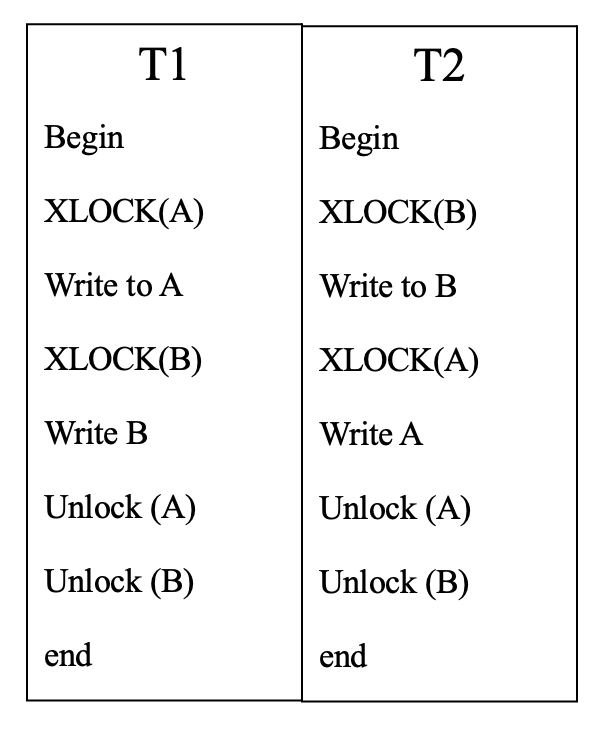
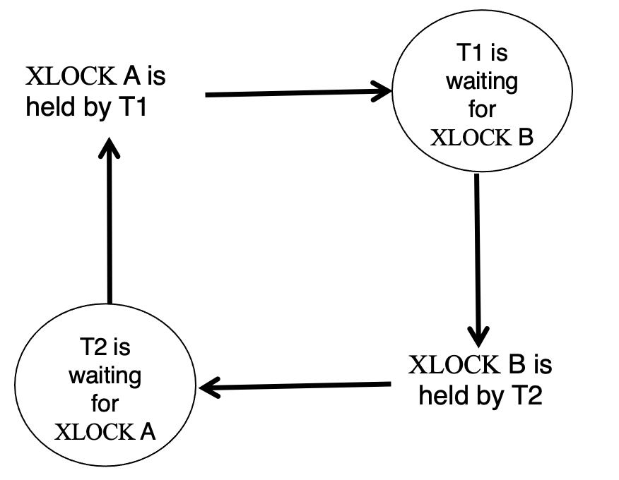
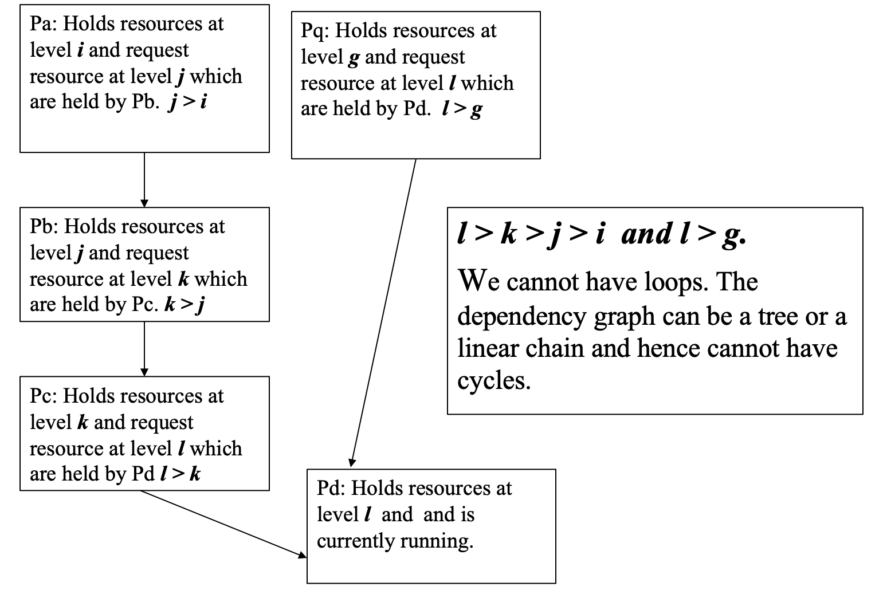
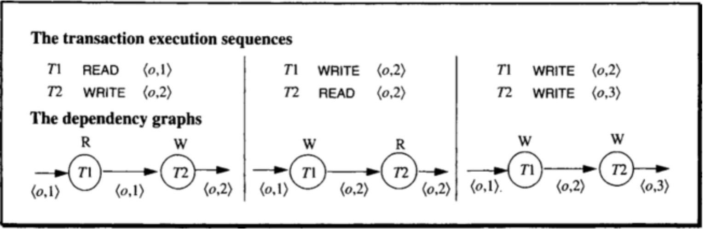

# Lecture 8-9 Concurrency Control

<h3 id="concurrent_example">Issues with Things are Accessed Concurrently</h3>

* E.g. of a shared counter = 100
* Assuming two tasks are running concurrently:
    * Task 1: counter = counter + 10
    * Task 2: counter = counter + 30
    
* Then the possible values of counter after the end of Task 1 and Task 2 are:
    * counter = 110: The action sequence is:
        * T1: Reads counter = 100
        * T2: Reads counter = 100
        * T2: Writes counter = 100 + 30
        * T1: Writes counter = 100 + 10
    * counter = 130
        * T1: Reads counter = 100
        * T2: Reads counter = 100
        * T1: Writes counter = 100 + 10
        * T2: Writes counter = 100 + 30
    * counter = 140
        * T1: Reads counter = 100
        * T1: Writes counter = 100 + 10
        * T2: Reads counter = 110
        * T2: Writes counter = 110 + 30
    
* For correct execution, we need to impose exclusive access to the shared variable counter by Task 1 and Task 2

## Concurrency Control: Programming

* Concurrency control is needed to preserve consistency of the data for some number of tasks to work on the data
* Different ways for concurrency control:
    * Dekker's algorithm (code-based): Needs almost no hardware support, but the code is very complicated to implement for more than two transactions/processes
    * OS supported primitives through interruption call: Expensive, independent of number of processes, machine independent
    * Spin locks(using atomic lock/unlock instructions): Most commonly used
    
### Dekker's Algorithm

* An implementation of exclusive access

* Needs almost no hardware support although it needs reads and writes to main memory

* The code is very complicated to implement if more than two transactions/processes are involved

* Takes storage space

* Use busy waiting

* Efficient if the lock contention, which is frequency of access to the locks, is low

* Sample code:
    ```java
    int turn;
    int wants[2];
    // i means me, j means the other 
    while (true) {
        wants[i] = true;
        while(wants[j]) {
            if (turn == j) {
                wants[i] = false;
                while (turn == j);
                wants[i] = true;
            }
        }
    }
    counter = counter + 1;
    turn = j;
    wants[i] = false;
    ```
  
* Extra Reference: [临界区互斥实现：Dekker互斥算法](https://zhuanlan.zhihu.com/p/122544351)

### OS Supported primitives such as Lock and Unlock

* Through an interrupt call, the lock request is passed to the OS

* Need no special hardware

* Are very expensive: several hundreds to thousands of instructions need to be executed to save context of the requesting process

* Do not use busy waiting and therefore more effective

### Spin Locks

* Execute using atomic machine instructions such as test and set or swap

* Need hardware support - should be able to lock bus (communication channel between CPU and memory + any other devices) for two memory
    cycles: one for reading and one for writing. During this time, no other devices' access is allowed to this memory location
  
* Use busy waiting

* Algorithm does not depend on number of processes

* Very efficient for low lock contentions. Many DBMSs systems use spin locks.

* Spin lock can implement either [Test and Set](#testset) or [Compare and Swap](#compareswap) as the lock function and used like `Lock(var)` and `Unlock(var)`

* Extra Reference: [看完你就明白的锁系列之自旋锁](https://www.cnblogs.com/cxuanBlog/p/11679883.html)

<h3 id="testset">Implementation of Atomic Operations: Test and Set</h3>

* Sample Code:
    ```c
    testAndSet(int *lock){
        /* The following is executed atomically, memory bus can be locked for up to twp cycles (one for reading and one for writing) */
        if (*lock == 1) {
            *lock = 0;
            return true;
        } else {
            return false;
        }
    ```
  
* Using test and set in spin lock for exclusive access:
    * Initial values:
        ```c
        int lock = 1;
        ```
    * T1:
        ```c
        /* Acquiring Lock */
        while (!testAndSet( &lock));
            /* Xlock granted */
        /* execlusive acces for T1 */;
        counter = counter + 1;
        /* release lock */
        lock = 1
        ```
    * T2:
        ```c
        /* Acquiring Lock */
        while (!testAndSet( &lock));
            /* Xlock granted */
        /* execlusive acces for T2 */;
        counter = counter + 1;
        /* release lock */
        lock = 1
        ```
      
<h3 id="compareswap">Implementation of Atomic Operation: Compare and Swap</h3>

* Some concurrency operations may have lost values:
    ```c
    temp = counter + 1; // unsafe to increment a shared counter
    counter = temp; // this assignment may suffer a lost update
    ```
  
* Instead, we can use the atomic operation of compare and swap function:
    ```c
    boolean cs(int *cell, int *old, int *new) {
        /* the following is executed atomically */
        if (*cell == *old) {
            *cell = *new;
            return true;
        } else {
            *old = *cell;
            return false;
        }
    }
    temp = counter;
    do {
        new = temp + 1
    } while (!cs(&counter, &temp, &new);
    ```
  
## Semaphores

* Semaphores derive from corresponding mechanism used for trains: A train may proceed through a section of track only if the 
    semaphores is clear. Once the train passes, the semaphore is set until the train exists that section of track
  
* Computer semaphores have a `get()` routine that acquires the semaphores and a dual `give()` routine that returns the semaphore
    to the free state, perhaps signalling a waiting process
  
* Implementations of exclusivity:
    * Needs a pointer to q queue of process
    * If the semaphore is busy but there are no waiters, the pointer is the address of the process that owns the semaphore
    * If some processes are waiting, the semaphore points to a linked list of waiting processes. The process owning the semaphore
        is at the end of this list
    * After usage, the owner process wakes up the oldest process in the queue
    
* Sample code:
    ```c
    /* Operation 1 */
    while (true) {
        wait(n);
        counter = counter + 1;
        release(n);
    }
    /* Operation 2 */
    while (true) {
        wait(n);
        counter = counter + 1;
        release(n);
    }
    wait (int n) {
        while (n <= 0);
        n--;
    }
    release (int n) {
        n++;
    }
    ```
  
* Extra Reference: [Semaphore 使用及原理](https://zhuanlan.zhihu.com/p/98593407)
  
## Deadlocks

* In a deadlock, each process in the deadlock is waiting for another member to release the resources it wants.

* E.g.:
    >  <br>
    > Resource Dependency Graph: <br>
    >  <br>
  
* Solutions:
    * Have enough resources so that no waiting occurs, which is not practical
    * Do not allow a process to wait, simply rollback after certain time. This can create live locks which are worse than deadlocks
    * Linearly order the resources and request of resources should follow this order. For example,
        A transaction after requesting `ith` resources can request `jth` resource if `j` > `i`. This type of allocation guarantees no cyclic dependencies among the transactions
      
* Illustration of Deadlocks:
    > 
  
### Deadlock Avoidance/Mitigation

* Pre-declare all necessary resources and allocate in a single request

* Periodically check the resource dependency graph for cycles. If a cycle exists, rollback (terminate) one or more transaction to eliminate cycles (deadlocks).
    The chosen transactions should be cheap.
  
* Allow waiting for a maximum time on a lock then force rollback. Many systems have chosen this approach.

* Many distributed database systems maintain only local dependency graphs and use timeouts for global deadlocks

### Deadlocks and Isolation Property

* Isolation ensures that concurrent transactions leaves the database in the same state as if the transactions were executed separately

* Isolation guarantees consistency, provided each transaction itself is consistent

* In the previous mentioned [example](#concurrency_example). With isolation property, the counter should result in `counter == 140`, because 
    `T2` should be executed after `T1` or vice versa.
  
* We can achieve isolation by sequentially processing each transaction, but generally not efficient and provides poor response times.

* We need to run transactions concurrently with goals of:
    * Concurrent execution should not cause application programs/transactions to malfunction
    * Concurrent execution should not have lower throughput or bad response times than serial execution
    
* To achieve isolation we need to understand dependency of operations

## Isolation and Dependencies

### Types of Dependencies

* Lost Update: Transaction 1 reads data first, then Transaction 2 modifies the data Transaction 1 reads and commits. 
    After that, Transaction 1 overwrites the data based on what it reads and commits. This will result in the lost of commits of Transaction 2
  
* Dirty Read: Transaction 1 writes the data first and did not commit the change. Then Transaction 2 reads the data that Transaction 1 writes. 
    For some reason, Transaction 1 rolls back. And if Transaction 2 reads the data again will result in the original data before changes rather than the previous read.
  
* Unrepeatable Read: Transaction 1 reads data first. Then Transaction 2 writes the data Transaction 1 reads and commits.
    If Transaction 1 reads the data again, it will result in the modified data from Transaction 2 rather the original reads. 
  
* Phantom Read: Transaction 1 runs a query and get result of some lines of results. Then Transaction 2 added several lines of data into
    the table. If Transaction 1 runs the same query again, it will result in several lines of results more because of the modification by Transaction 2.
  
* Extra Reference: 
    * [图解脏写、脏读、不可重复读、幻读](https://zhuanlan.zhihu.com/p/164924094)
    
    * [脏读、幻读和不可重复读](https://zhuanlan.zhihu.com/p/164924094)
    
### How to Find the Dependencies

* Dependency Model:
    * I<sub>i</sub>: Set of inputs (objects that are read) of a transaction T<sub>i</sub>
    * O<sub>i</sub>: Set of outputs (objects that are modified) of a transaction T<sub>i</sub>
    * O<sub>j</sub> and I<sub>j</sub> are not necessarily disjoint that is O<sub>j</sub> &cap; I<sub>j</sub> &ne; &empty;
    
* Given a set of transaction &tau;, Transaction T<sub>j</sub> has no dependency on any transaction T<sub>i</sub> in &tau; if:
    > O<sub>i</sub> &cap; (I<sub>j</sub> &cup; O<sub>j</sub>) = empty for all i &ne; j
  
* This approach cannot be planned ahead as in many situation inputs and outputs may be state dependant or not known in prior

* If the inputs and outputs of the concurrent transactions are not disjoint, the following dependencies are important:
    > 
  
    * Read-Read dependency does not affect isolation
    
* When dependency graph has cycles, then there is a violation of isolation and a possibility of inconsistency

### Formal Definition of Dependency

* Let `H` be a history sequence of tuples of the form `(T, action, object)`

* Let `T1` and `T2` are transactions in `H`. If `T1` performs an action on an object `O`, then `T2` performs an action on the same `O`,
    and there is no write action in between by another transaction on `O`, then `T2` depends on `T1`
  
* Formally, the dependency of `T2` on `T1`: `(T1, O, T2)` exists in history `H` if there are indexes `i` and `j` such that `i < j`,
    `H[i]` involves action `a1` on `O` by `T1`(e.g. `H[i] = (T1, a1, O)`) and `H[j]` involves action `a2` on `O` by `T2` (e.g. `H[j] = (T2, a2, O)`)
    and there are no other `H[k] = (T', WRITE, O)` for i < k < j
  
* Dependency graph: Transactions are nodes, and object labels the edges from the node `Ti` to `Tj` if `(Ti, O, Tj)` is in `DEP(H)`

### Dependency Relations

* Because Read-Read dependency does not affect isolation, only need to focus on three scenarios:
    * a1 = WRITE & a2 = WRITE
    * a1 = WRITE & a2 = READ
    * a1 = READ & a2 = WRITE
    
#### Equivalence

* `DEP(H) = {(Ti, O, Tj) | Tj depends on Ti }`

* Given two histories `H1` and `H2` contain the same tuples, `H1` and `H2` are equivalent if `DEP(H1) = DEP(H2)` 

* This implies that a given badabase will end up in exactly the same final state by executing either of the sequence of operations in `H1` or `H2`

* E.g.:
    * `H1 = <(T1, R, O1), (T2, W, O5), (T1, W, O3), (T3, W, O1), (T5, R, O3), (T3, W, O2), (T5, R, O4), (T4, R, O2), (T6, W, O4)`
    * `DEP(H1) = {<T1, O1, T3>, <T1, O3, T5>, <T3, O2, T4>, <T5, O4, T6>`
    * `H2 = <(T1,R,O1), (T3,W,O1), (T3,W,O2),(T4,R,O2),(T1,W,O3), (T2, W, O5), (T5,R,O3), (T5,R,O4), (T6,W,O4)>`
    * `DEP(H2) = {<T1, O1,T3>, <T1,O3,T5>, <T3,O2,T4>, <T5,O4,T6> }`
    * `DEP(H1) = DEP(H2)`
    
### Isolated History

* A history is said to be isolated if it is equivalent to a serial history as if all transactions are executed serially/sequentially and then we will be fine basically

* A serial history is history that is resulted as a consequence of running transactions sequentially one by one. N transactions can result in a maximum of N! serial histories

* E.g.:
    > If T1 precedes T2, it is written as T1 << T2 <br>
    >  Before(T) = {T' | T' << T}
    >  After(T) = {T' | T << T' }
  
### Wormhole Transaction

* A transaction `T'` is called a wormhole transaction if T' &isin; Before(T) &cap; After(T)

* That is T << T' << T. This implies there is a cycle in the dependency graph of the history. 

* Presence of a wormhole transaction implies it is not isolated. Thus not a serial sechedule

* Wormhole theorem: A history is isolated if and only if it has no wormholes.

### Ensuring No Wormholes Appear

* We first need to use locks to make sure access is done in an orderly fashion

* We need to avoid cycles in the dependency graphs

* So locking in DBMSs is different than other programming cases as you need to consider multiple resource accesses and their dependencies in transactions

* It is also important to see if we had all the transactions upfront we can find the eliminate cycles but in real life we do not know what is coming most of the time.
  